## 1. Cover page (Appendix A format)

The Hong Kong Polytechnic University
Department of Computing

COMP4913 Capstone Project
Report (Final)

Financial Time-Series Prediction Using Advanced Neural Network Models

Student Name:
CHAN Cheung Hong
Student ID No.:
22081328D
Programme-Stream Code:
61435-FCS
Supervisor:
Dr Yujie Wu
Co-Examiner:

2nd Assessor:

Submission Date:
31 March 2026

## 2. Abstract

This project benchmarks sequence models for short-horizon forecasting under a unified and reproducible pipeline that now supports **multiple target definitions** and both **real (SPY)** and **synthetic (sine)** data sources. The latest archived final-report bundle (generated at `2026-03-31T14:00:27Z`) evaluates four tasks: `sine_next_day`, `next_return`, `next_volatility`, and `next_mean_return`. Across these tasks, RNN, LSTM, GRU, Transformer, and a flattened-sequence linear-regression baseline are compared on aligned splits using MSE/MAE and directional accuracy (DA).

The cross-task summary shows that **Baseline-LR** is best on `sine_next_day` and `next_volatility`, **LSTM** is best on `next_return`, and **GRU** is best on `next_mean_return`. The best test MSE values are `4.8070e-08` (sine), `9.1979e-05` (next_return), `1.7733e-05` (next_volatility), and `1.5519e-05` (next_mean_return). These outcomes reinforce two conclusions: (1) no single neural architecture dominates all task definitions, and (2) strong linear baselines remain essential in financial-style forecasting benchmarks.

---

## 3. Table of Contents

- 1. Cover page (Appendix A format)
- 2. Abstract
- 3. Table of contents
- 4. List of tables and figures
- 5. Main body
  - Chapter 1. Introduction
  - Chapter 2. Background and Literature Context
  - Chapter 3. Problem Statement and Objectives
  - Chapter 4. Data and Pre-processing
  - Chapter 5. Methodology
  - Chapter 6. Experimental Design and Hyperparameter Tuning
  - Chapter 7. Results
  - Chapter 8. Discussion
  - Chapter 9. Limitations
  - Chapter 10. Conclusion and Future Work
  - Chapter 11. Project Contributions / What Has Been Achieved
- 6. References/Bibliography
- 7. Appendices

## 4. List of Tables and Figures

### Tables
- Table 1. Cross-task consolidated summary.
- Table 2. Updated report artifact map.
- Table A-1. Final tuned configurations (latest bundle highlights).

### Figures
- Figure 1. Training-loss comparison for the best tuned models and baseline.
- Figure 4A-1 to Figure 4D-6. Per-task training/validation/testing, hyperparameter impact, scatter, and prediction-slice visuals.

## 5. Main Body

\newpage

### Chapter 1. Introduction

### 1.1 Project background

Financial time-series forecasting remains a difficult problem because market data are noisy, non-stationary, and often only weakly predictable. Even when useful structure exists, the signal-to-noise ratio is usually small, particularly for return prediction rather than price-level prediction. This challenge has motivated extensive use of machine learning and deep learning methods for sequence modelling, especially recurrent architectures and attention-based models. [1], [5], [8]

This project focuses on a **configurable short-horizon forecasting system** where targets are defined by `target_mode`, `horizon`, and `target_smooth_window`. The final archive includes one synthetic sanity task (`sine_next_day`) and three SPY market tasks (`next_return`, `next_volatility`, `next_mean_return`). SPY remains a reasonable proxy for broad U.S. equity-market behaviour, while the synthetic sine task provides a controlled check that the pipeline behaves sensibly under an easier signal regime. [9]

### 1.2 Problem statement

The core problem is not simply to generate forecasts, but to determine whether more expressive neural sequence models provide a measurable advantage over a simpler baseline when all methods are trained and evaluated on the same prepared dataset. In financial forecasting, complex models can easily appear promising while actually overfitting noisy data. Therefore, a fair shared-split comparison is academically more meaningful than isolated single-model demonstrations. [1], [5]

### 1.3 Research aim

The aim of this project is to benchmark several neural sequence architectures across the implemented task system—covering both the synthetic sanity task and multiple SPY target definitions—and determine whether any of them outperform a flattened-sequence linear-regression baseline in prediction error and directional accuracy under matched splits and preprocessing.

### 1.4 Objectives

The specific objectives are:

1. To construct a reproducible forecasting pipeline for SPY daily log returns.
2. To compare RNN, LSTM, GRU, and Transformer models under shared experimental conditions.
3. To include a linear-regression baseline built from the same lagged input window.
4. To perform staged hyperparameter tuning using validation MSE.
5. To analyse both magnitude-based error metrics and directional accuracy.

### 1.5 Scope of the project

The latest archived report bundle covers four fully populated tasks: `sine_next_day`, `next_return`, `next_volatility`, and `next_mean_return`. Claims in this report are scoped to these definitions, with each task tracked by explicit `task_id`, `target_mode`, `horizon`, and (where applicable) `target_smooth_window`.

### 1.6 Report organisation

The remainder of this report covers background literature, formal task definition, data preparation, methodology, tuning design, results, discussion, limitations, conclusion, and appendices.

---

\newpage

### Chapter 2. Background and Literature Context

### 2.1 Financial time-series forecasting

Financial forecasting has long been studied through both statistical and machine-learning approaches. A useful distinction is between forecasting prices and forecasting returns. Prices usually contain strong trends and scale effects, whereas returns are closer to stationary and are therefore more appropriate for modelling short-term predictive relationships. However, this also makes the forecasting problem harder because much of the predictable structure has already been removed. [5], [8]

Prior work has shown that deep sequence models can capture nonlinear temporal relationships in financial data, but the size of the advantage depends strongly on the market, target variable, and evaluation design. Fischer and Krauss, for example, demonstrated that LSTM networks can be effective in financial market prediction, while also highlighting the fragility of performance under realistic conditions. [1]

### 2.2 Traditional and machine-learning baselines

A simple linear model remains an important baseline in time-series forecasting because it offers interpretability, low variance, and a useful reference point for judging whether a more complex model actually extracts additional structure. When a neural network only marginally outperforms linear regression, the correct interpretation is usually that the forecasting signal is weak or that the task is close to the limit of what is learnable from the available features. [5], [10]

### 2.3 Recurrent neural networks

Vanilla RNNs explicitly process ordered sequences by updating a hidden state across time steps. This makes them a natural baseline neural architecture for sequential forecasting, but standard RNNs are known to struggle with unstable gradients and limited long-range memory. [2], [6]

### 2.4 LSTM and GRU improvements over vanilla RNN

LSTM networks introduce gated memory cells that help preserve information over longer horizons, making them well suited to sequence tasks where delayed dependencies matter. [2] GRUs provide a related gated mechanism with a simpler parameterisation and often achieve comparable performance with lower computational overhead. [3] In financial forecasting, both architectures are widely used because they offer a better trade-off between expressiveness and trainability than a plain RNN. [1]

### 2.5 Transformer models for sequence learning

Transformers replace recurrence with self-attention, which can model pairwise relationships across all positions in a sequence. This design has achieved outstanding results in natural language processing and many other sequence domains. [4] Nevertheless, Transformer performance depends heavily on dataset scale, architecture choices, and tuning budget. On relatively small financial datasets with limited input dimensionality, the expected advantage over recurrent models is less certain. [4], [8]

### 2.6 Research gap and project positioning

This project is positioned as a controlled benchmark rather than a claim of trading-system superiority. Its contribution is to compare RNN, LSTM, GRU, Transformer, and linear regression under one aligned preprocessing/evaluation workflow across explicitly defined tasks: `sine_next_day` (synthetic sanity), plus SPY `next_return`, `next_volatility`, and `next_mean_return` (market targets). This framing avoids overgeneralising from any single return definition and keeps conclusions tied to concrete `target_mode`/`horizon`/`target_smooth_window` settings.

---

\newpage

### Chapter 3. Problem Statement and Objectives

### 3.1 Forecasting task definition

The forecasting system is formulated as supervised learning on multifeature sequences. Let \(\mathbf{f}_t \in \mathbb{R}^8\) denote the engineered feature vector at day \(t\), and let each sample be a rolling lookback window:

\[
X_t = [\mathbf{f}_{t-L+1}, \ldots, \mathbf{f}_t]
\]

where \(L\) is the sequence length (`seq_len`, tuned per task/model). The repository supports multiple targets via `target_mode`:

- `sine_next_day` (synthetic sanity task),
- `next_return` (1-step return),
- `next_volatility` (forward rolling volatility),
- `next_mean_return` (forward rolling mean return),
- plus default/general modes such as `horizon_return`.

The latest final-report archive evaluates these four task IDs:

1. `sine_next_day` (`data_source=sine`, `horizon=1`, `target_smooth_window=1`),
2. `next_return` (`data_source=spy`, `horizon=1`, `target_smooth_window=1`),
3. `next_volatility` (`data_source=spy`, `horizon=1`, `target_smooth_window=5`),
4. `next_mean_return` (`data_source=spy`, `horizon=1`, `target_smooth_window=5`).

### 3.2 Research questions

The report addresses the following research questions:

1. Which neural architecture performs best under the shared pipeline when evaluated task-by-task (`sine_next_day`, `next_return`, `next_volatility`, `next_mean_return`)?
2. How do model rankings differ between the synthetic sanity task (`sine_next_day`) and the SPY market tasks (`next_return`, `next_volatility`, `next_mean_return`)?
3. Does a tuned neural model outperform the linear-regression baseline within each task definition rather than only on a single return target?
4. Is lower MSE associated with better directional accuracy across these task definitions?

### 3.3 Project objectives

The technical objective is to produce an apples-to-apples comparison with common data preparation, common split boundaries, common evaluation metrics, and validation-driven model selection.

### 3.4 Success criteria

A model is considered successful if it demonstrates lower validation and test error than alternatives under the shared setup. However, because financial forecasting is often used for directional decisions, directional accuracy is also reported as a complementary metric rather than relying on MSE alone.

---

\newpage

### Chapter 4. Data and Pre-processing

### 4.1 Data source and asset selection

The latest report bundle evaluates both **synthetic** and **market** tasks. For market tasks, data are downloaded from Yahoo Finance through `yfinance` with SPY as the instrument and repository default `START=2005-01-01`. In parallel, the `sine_next_day` task uses the repository’s generated sine-series feature frame as a controlled sanity benchmark. [9], [11]

### 4.2 Return definition

The raw downloaded close series is converted to **daily log returns**:

\[
r_t = \log\left(\frac{P_t}{P_{t-1}}\right)
\]

Using returns instead of prices reduces scale effects and makes the target more appropriate for short-horizon statistical learning. [5]

### 4.3 Sequence construction

For neural models, the repository builds three-dimensional input tensors of shape \((N, \texttt{seq\_len}, 8)\), where each sample contains `seq_len` consecutive days of 8 engineered features and one scalar target. The tuned search space includes `seq_len ∈ {20, 30, 60}` in `src/tuning/main.py`.

The 8 engineered features produced by `build_spy_feature_frame` are:

1. `log_ret`
2. `oc_ret`
3. `hl_range`
4. `vol_chg`
5. `ma_5_gap`
6. `ma_20_gap`
7. `volatility_5`
8. `volatility_20`

Target construction is controlled by `target_mode`, `horizon`, and `target_smooth_window`. In the latest archived bundle, the evaluated tasks are `sine_next_day`, `next_return`, `next_volatility` (`target_smooth_window=5`), and `next_mean_return` (`target_smooth_window=5`).

For transparency, the archived best-tuned comparisons use the following winning `seq_len` values by task (best test-MSE run per task):

| Task | Best test-MSE winner | Winning `seq_len` |
| --- | --- | ---: |
| `sine_next_day` | Baseline-LR | 30 |
| `next_return` | LSTM | 30 |
| `next_volatility` | Baseline-LR | 20 |
| `next_mean_return` | GRU | 30 |

### 4.4 Train/validation/test split

Splitting is chronological rather than random for all tasks, preventing future information leakage into training. The same train/validation/test protocol is applied consistently across the four archived tasks in `reports/final_report_tasks/20260331T125121Z`.

### 4.5 Normalisation and leakage prevention

The input sequences are standardised with `StandardScaler`, fitted only on the training inputs and then applied to validation and test sets. This avoids information leakage from future periods into the training transformation pipeline, which would otherwise bias the evaluation. [5], [10]

---

\newpage

### Chapter 5. Methodology

### 5.1 Overall pipeline

All models share the same high-level pipeline:

1. Download SPY historical data.
2. Compute daily log returns.
3. Build aligned input sequences with 8 features per step and a task-specific configured target (`sine_next_day`, `next_return`, `next_volatility`, or `next_mean_return`).
4. Split the data chronologically into training, validation, and test sets.
5. Fit the scaler on training inputs only.
6. Train each model using validation-based checkpoint selection.
7. Compare the final archived runs using MSE, MAE, and directional accuracy.

### 5.2 Baseline model

The baseline is a flattened-sequence **linear regression** model. It uses the same multifeature `seq_len` window as the neural models, but reshapes each \((\texttt{seq\_len}, 8)\) sequence into a tabular vector (`seq_len × 8` features) so the target alignment remains identical. This baseline tests whether nonlinear sequence modelling provides gains beyond a strong linear model on the same information set. [5], [10]

### 5.3 RNN model

The vanilla RNN model consists of a recurrent layer over the `seq_len` input sequence followed by a linear output layer that maps the last hidden state to a scalar forecast. This architecture serves as the simplest neural sequence benchmark. [6]

### 5.4 LSTM model

The LSTM model replaces the simple recurrent cell with gated memory units and again uses the last sequence output to produce a one-step scalar prediction. The expectation from literature is that LSTM should be better able to preserve useful information over the lookback window. [1], [2]

### 5.5 GRU model

The GRU model is structurally similar to the LSTM model but uses update and reset gates with fewer parameters. It is included to test whether a lighter gated recurrent architecture can match or exceed LSTM on this task. [3]

### 5.6 Transformer model

The Transformer model first projects each 8-dimensional timestep feature vector into a learned embedding space, adds positional encodings, applies stacked Transformer encoder layers, and uses the final time-step representation for scalar prediction. This architecture is intended to test whether self-attention can outperform recurrence on this multifeature financial sequence problem. [4]

### 5.7 Configuration source of truth

Repository-level defaults (for example `HORIZON=1`, `TARGET_MODE=horizon_return`) are defined in `src/common/config.py`. Run-specific overrides (including CLI overrides such as `--horizon` and `--target-mode`) are resolved through `src/common/runtime_config.py` and then passed into experiment preparation, so archived experiments may intentionally differ from defaults.

For this report, the **archived final metrics are taken from runtime-resolved experiment configs** (effective CLI + staged-winner selections), **not** from static defaults in `src/common/config.py`. Concretely, run truth is read from `reports/final_report_tasks/20260331T125121Z/tuning_winners.csv`, per-task `reports/final_report_tasks/20260331T125121Z/*/best_tuned_comparison_*.md`, and the bundle-level synthesis `reports/final_report_tasks/20260331T125121Z/overall_task_summary.md`.

### 5.8 Training strategy

The training workflow uses the Adam optimiser, mean squared error loss, early stopping with validation-loss smoothing, checkpointing of the best validation state, and scheduler-based learning-rate reduction. Hyperparameter selection is validation-driven, and the final archived best-tuned comparison was generated from the frozen winners stored in `tuning_winners.csv`. [12]

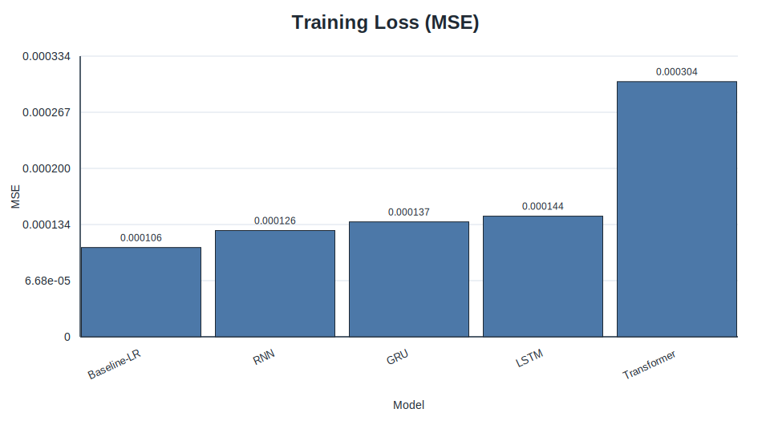

*Figure 1. Training-loss comparison for the best tuned models and baseline.*

### 5.9 Evaluation metrics

Three metrics are reported:

- **MSE:** penalises large forecast errors and is the main optimisation/evaluation criterion.
- **MAE:** provides a scale-consistent average absolute error.
- **Directional Accuracy (DA):** measures the fraction of predictions whose sign matches the realised return.

DA is particularly relevant in finance because a model can sometimes produce modestly inaccurate magnitudes while still being useful for direction-of-move classification.

However, DA must be interpreted **by `target_mode`** rather than as a uniform cross-task score. For signed return-style targets (for example `next_return` and `next_mean_return`), DA is meaningfully discriminative because the sign directly encodes up/down direction. For level-like or strictly non-negative targets (especially `next_volatility`, defined from rolling standard deviation), sign-based DA is not a discriminative metric and can quickly saturate near a ceiling. Therefore, on `next_volatility`, model ranking should prioritise **MSE/MAE** and treat DA only as a weak supplementary indicator.

---

\newpage

### Chapter 6. Experimental Design and Hyperparameter Tuning

### 6.1 Purpose of tuning

Hyperparameter tuning is necessary because model comparisons are not meaningful when architectures are evaluated only at arbitrary default settings. This project uses a staged tuning workflow to search for better-performing configurations using validation MSE as the selection criterion.

### 6.2 Tuning procedure

The tuning process is sequential. For recurrent models, the stages are:

1. learning rate,
2. hidden size,
3. number of layers,
4. batch size.

For the Transformer, the stages are:

1. learning rate,
2. model dimension,
3. number of encoder layers,
4. number of attention heads,
5. batch size.

At each stage, the winning value is frozen before the next parameter group is explored.

### 6.3 Search dimensions by model

The recurrent models and the Transformer do not share identical search spaces because their architectures differ. This is reasonable, but the same validation-based winner-selection rule is applied consistently across all model families.

### 6.4 Best configurations obtained

The latest archive contains task-specific tuned winners rather than one global best configuration. Cross-task winners by test MSE are:

| task_id | Winner | Best test MSE |
| --- | --- | ---: |
| `sine_next_day` | Baseline-LR | 4.807035774110167e-08 |
| `next_return` | LSTM | 9.197905455948785e-05 |
| `next_volatility` | Baseline-LR | 1.7733482060336406e-05 |
| `next_mean_return` | GRU | 1.5519119187956676e-05 |

This confirms that tuning outcomes are task-dependent and should be interpreted per `task_id`.

### 6.5 Threats to validity in tuning

Sequential tuning is efficient, but it does not exhaustively search hyperparameter interactions. A later parameter sweep can make an earlier frozen choice suboptimal. Therefore, the chosen winners should be interpreted as strong practical settings found under a constrained tuning budget rather than globally optimal architectures.

---

\newpage

### Chapter 7. Results

This chapter reports outcomes by **task**, where each task is identified by `task_id` and defined by `target_mode` + `horizon` (+ `target_smooth_window` where applicable).

### 7.1 Cross-task consolidated summary

Table 1 summarises the best-tuned winner for each task from `overall_task_summary.md`.

| Task | task_id | target_mode | horizon | target_smooth_window | Best model (test MSE) | Best test MSE |
| --- | --- | --- | ---: | ---: | --- | ---: |
| Task A | `sine_next_day` | `sine_next_day` | 1 | 1 | Baseline-LR | 4.807035774110167e-08 |
| Task B | `next_return` | `next_return` | 1 | 1 | LSTM | 9.197905455948785e-05 |
| Task C | `next_volatility` | `next_volatility` | 1 | 5 | Baseline-LR | 1.7733482060336406e-05 |
| Task D | `next_mean_return` | `next_mean_return` | 1 | 5 | GRU | 1.5519119187956676e-05 |

### 7.2 Per-task tuned comparison highlights

#### Task A — `sine_next_day`
- Best model by test MSE: **Baseline-LR** (4.8070e-08).
- Best neural model by test MSE: **LSTM** (1.1095e-07).
- DA remains high for both baseline and recurrent models (Baseline-LR: 0.9702, LSTM: 0.9864).

#### Task B — `next_return`
- Best model by test MSE: **LSTM** (9.1979e-05).
- GRU is a close second (9.2194e-05).
- Baseline-LR is competitive but weaker on this task (1.2176e-04).

#### Task C — `next_volatility`
- Best model by test MSE: **Baseline-LR** (1.7733e-05).
- Best neural model: **GRU** (1.9411e-05).
- Directional accuracy is near-saturated for most models because volatility targets are non-negative and trend smoother in sign.

#### Task D — `next_mean_return`
- Best model by test MSE: **GRU** (1.5519e-05).
- LSTM and RNN are close behind (1.6130e-05 and 1.6560e-05).
- Baseline-LR trails tuned recurrent winners on this task (2.1937e-05).

### 7.3 Updated report artifact map

| Task | `task_id` | Comparison report | Figures directory |
| --- | --- | --- | --- |
| Task A | `sine_next_day` | `reports/final_report_tasks/20260331T125121Z/sine_next_day/best_tuned_comparison_sine_next_day.csv` | `reports/final_report_tasks/20260331T125121Z/sine_next_day/figures/` |
| Task B | `next_return` | `reports/final_report_tasks/20260331T125121Z/next_return/best_tuned_comparison_next_return.csv` | `reports/final_report_tasks/20260331T125121Z/next_return/figures/` |
| Task C | `next_volatility` | `reports/final_report_tasks/20260331T125121Z/next_volatility/best_tuned_comparison_next_volatility.csv` | `reports/final_report_tasks/20260331T125121Z/next_volatility/figures/` |
| Task D | `next_mean_return` | `reports/final_report_tasks/20260331T125121Z/next_mean_return/best_tuned_comparison_next_mean_return.csv` | `reports/final_report_tasks/20260331T125121Z/next_mean_return/figures/` |

### 7.4 Prediction pattern visualisation (updated figures)

To ensure the final report directly embeds the key visuals from `reports/final_report_tasks/20260331T125121Z`, the most important per-task figures are shown below as Markdown images.

#### Key figures (quick reference)

This quick-reference block surfaces a compact set of high-signal visuals before the full per-task gallery. For tasks where the overall winner is Baseline-LR (which has no scatter/pred-slice plots in the archive), the best neural model’s scatter/pred-slice is shown.

- **Task A (`sine_next_day`)** — cross-model testing-loss summary + best-neural (LSTM) prediction views

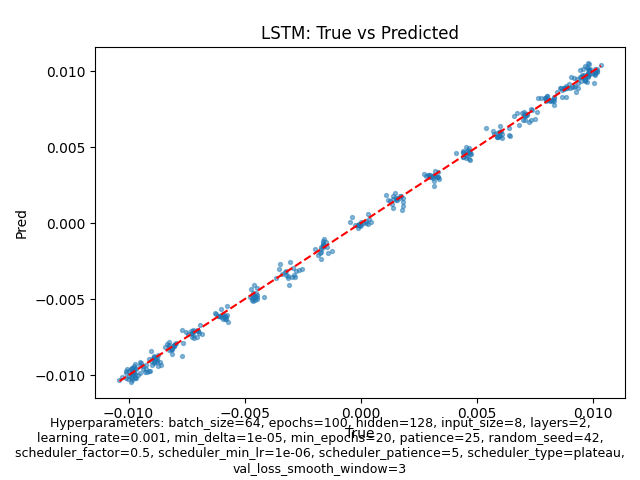

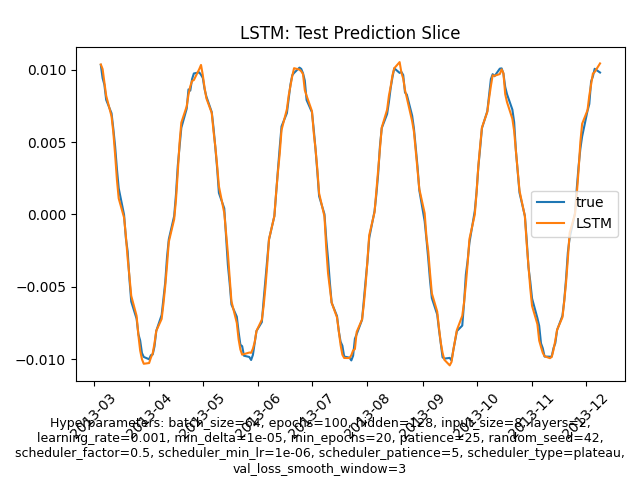

- **Task B (`next_return`)** — cross-model testing-loss summary + winner (LSTM) prediction views

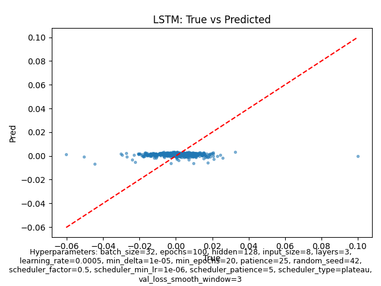

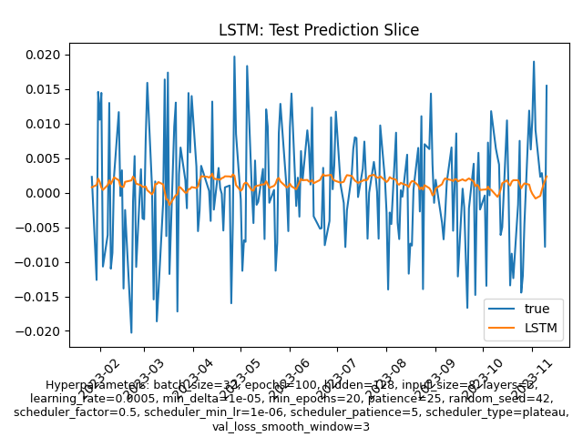

- **Task C (`next_volatility`)** — cross-model testing-loss summary + best-neural (GRU) prediction views

- **Task D (`next_mean_return`)** — cross-model testing-loss summary + winner (GRU) prediction views

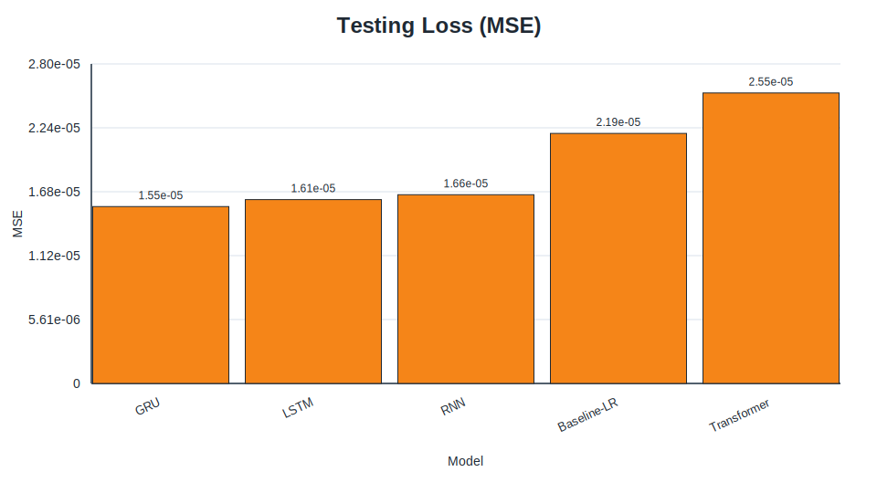

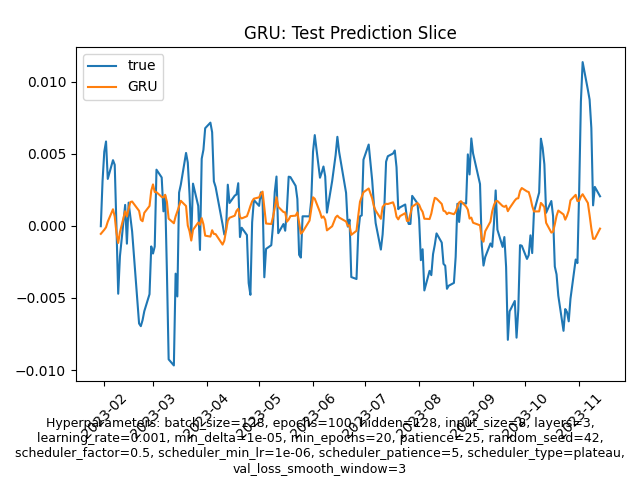

#### Task A — `sine_next_day`

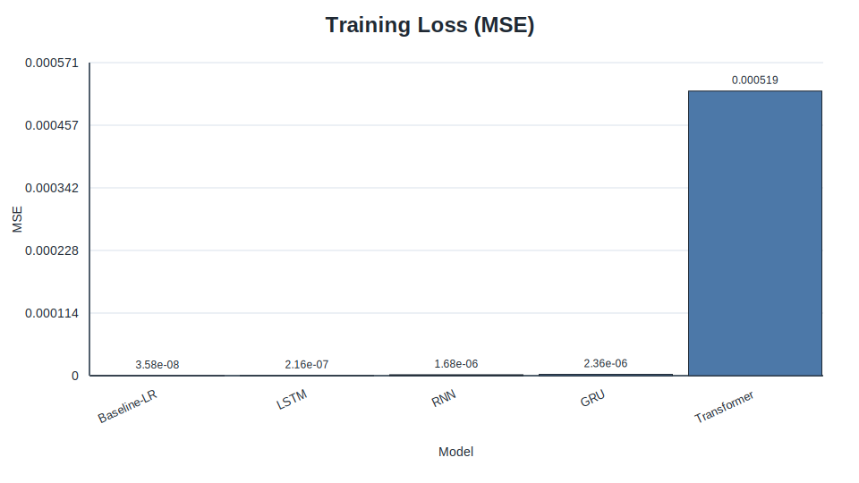

*Figure 4A-1. Best-tuned training-loss comparison for `sine_next_day`.*

*Figure 4A-2. Best-tuned validation-loss comparison for `sine_next_day`.*

*Figure 4A-3. Best-tuned testing-loss comparison for `sine_next_day`.*

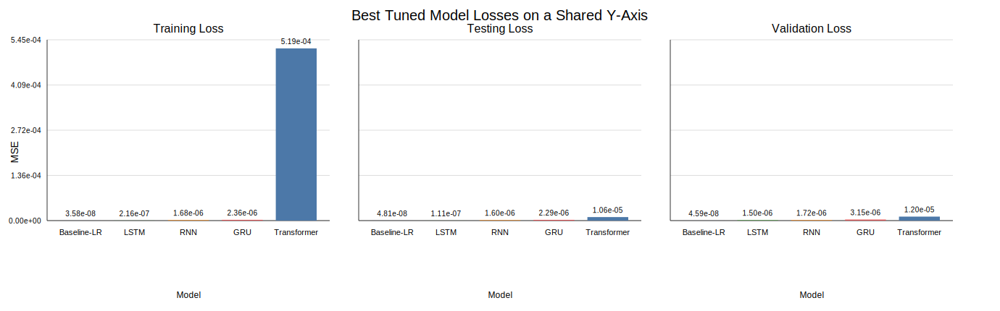

*Figure 4A-4. Hyperparameter-impact model-loss summary for `sine_next_day`.*

*Figure 4A-5. LSTM predicted-vs-actual scatter for `sine_next_day` tuned comparison.*

*Figure 4A-6. LSTM prediction slice for `sine_next_day` tuned comparison.*

#### Task B — `next_return`

*Figure 4B-1. Best-tuned training-loss comparison for `next_return`.*

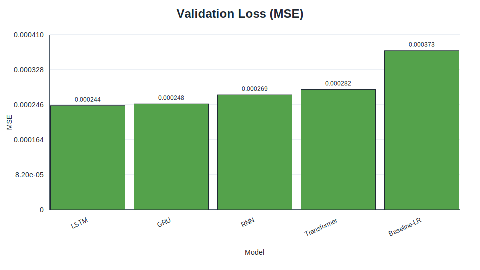

*Figure 4B-2. Best-tuned validation-loss comparison for `next_return`.*

*Figure 4B-3. Best-tuned testing-loss comparison for `next_return`.*

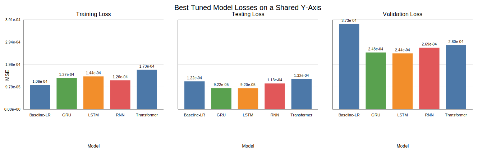

*Figure 4B-4. Hyperparameter-impact model-loss summary for `next_return`.*

*Figure 4B-5. LSTM predicted-vs-actual scatter for `next_return` tuned comparison.*

*Figure 4B-6. LSTM prediction slice for `next_return` tuned comparison.*

#### Task C — `next_volatility`

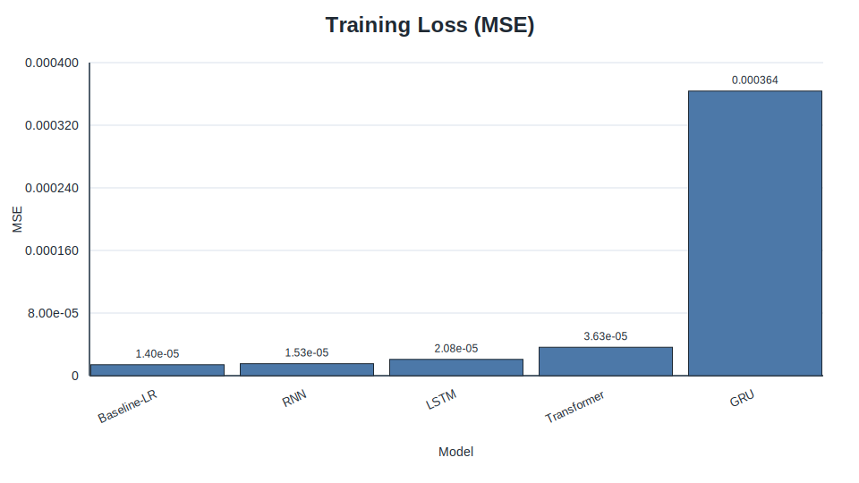

*Figure 4C-1. Best-tuned training-loss comparison for `next_volatility`.*

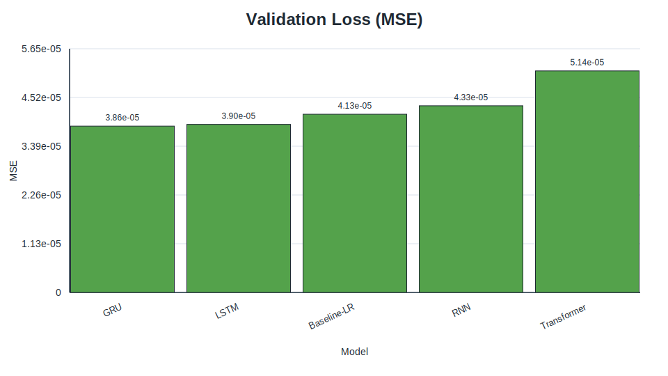

*Figure 4C-2. Best-tuned validation-loss comparison for `next_volatility`.*

*Figure 4C-3. Best-tuned testing-loss comparison for `next_volatility`.*

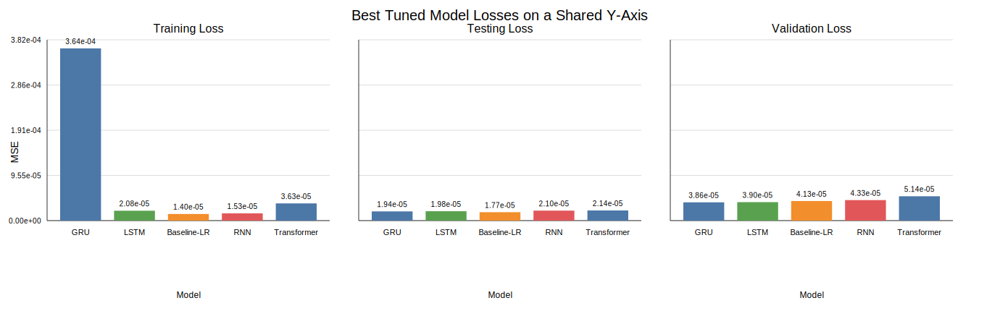

*Figure 4C-4. Hyperparameter-impact model-loss summary for `next_volatility`.*

*Figure 4C-5. GRU predicted-vs-actual scatter for `next_volatility` tuned comparison.*

*Figure 4C-6. GRU prediction slice for `next_volatility` tuned comparison.*

#### Task D — `next_mean_return`

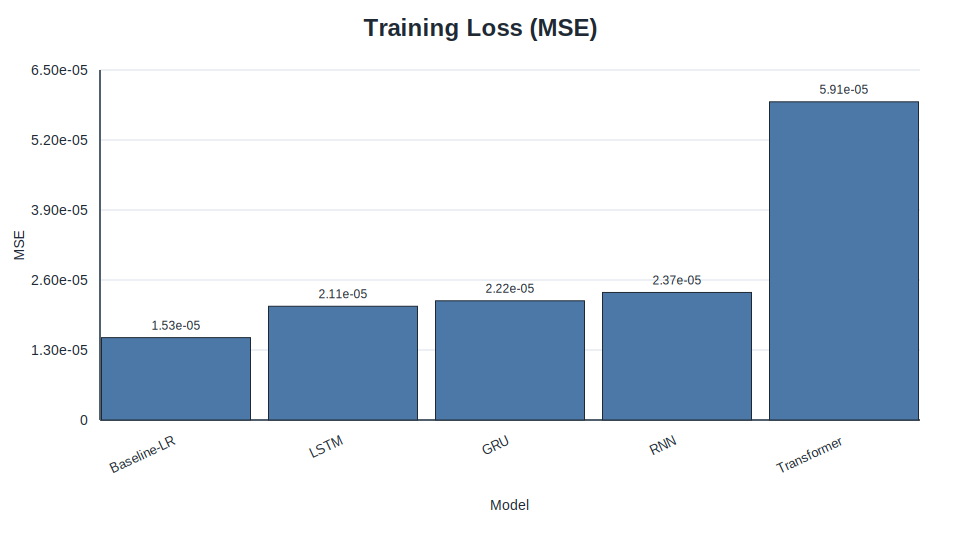

*Figure 4D-1. Best-tuned training-loss comparison for `next_mean_return`.*

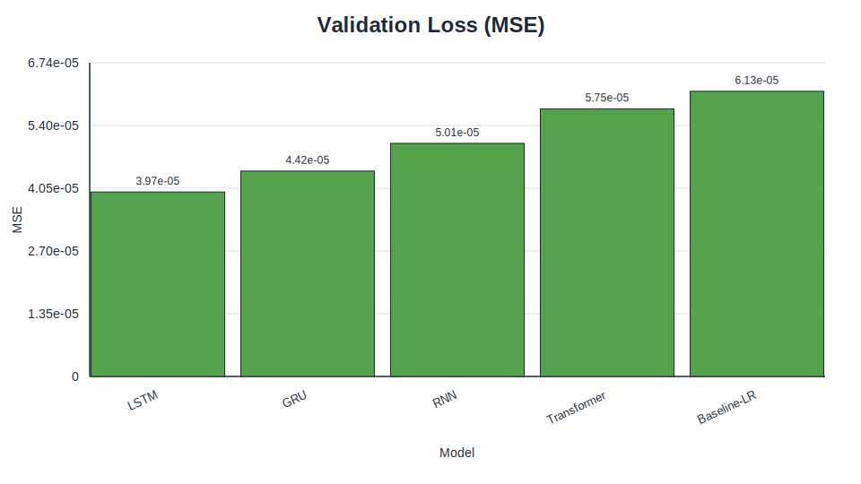

*Figure 4D-2. Best-tuned validation-loss comparison for `next_mean_return`.*

*Figure 4D-3. Best-tuned testing-loss comparison for `next_mean_return`.*

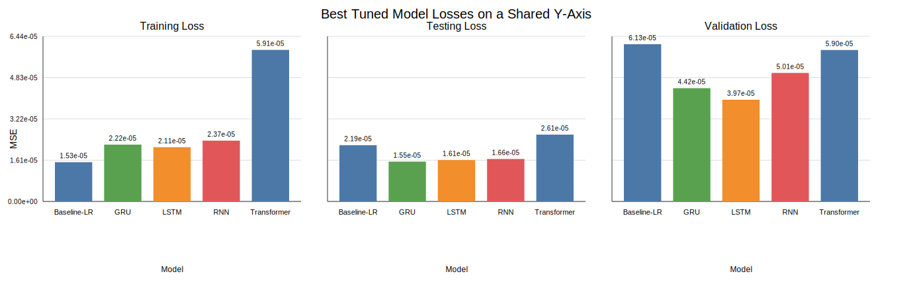

*Figure 4D-4. Hyperparameter-impact model-loss summary for `next_mean_return`.*

*Figure 4D-5. GRU predicted-vs-actual scatter for `next_mean_return` tuned comparison.*

*Figure 4D-6. GRU prediction slice for `next_mean_return` tuned comparison.*

### 7.5 Summary of key findings

- No single architecture dominates all tasks.
- **Baseline-LR** remains a strong benchmark and wins 2/4 tasks.
- **LSTM** is strongest on `next_return`.
- **GRU** is strongest on `next_mean_return`.
- The latest report should be interpreted as a **task-conditioned benchmark** rather than a universal ranking of model families.

---

\newpage

### Chapter 8. Discussion

### 8.1 Interpretation of the winning model

The latest bundle shows no universal single winner; instead, winners vary by task definition. This is still consistent with literature: gated recurrent models remain strong on noisy sequence forecasting, while simpler baselines can dominate when the target is smoother or effectively linear. [1], [2], [5]

### 8.2 Why the baseline remained competitive

The strong baseline result may be the most informative outcome in the report. If a linear model nearly matches the best neural model, the appropriate interpretation is not that neural methods failed, but that the task itself contains limited predictable structure under the chosen feature set. This is entirely plausible for daily equity-index returns, where much of the variation may be close to noise at this horizon. [1], [5], [8]

### 8.3 Error metrics versus directional accuracy

The GRU’s superior directional accuracy but weaker MSE illustrates a meaningful metric trade-off. A model can make slightly larger magnitude errors while still predicting the correct sign more often. For decision-making tasks where direction matters more than calibrated return size, that distinction could be important.

At the same time, this interpretation boundary is **target-dependent**. DA comparisons are most informative for targets whose realised values are naturally signed (such as `next_return` and `next_mean_return`). For `next_volatility` (forward rolling standard deviation), the target is non-negative by construction, so sign-based DA can become near-constant and non-discriminative across models. In that case, lower MSE/MAE should be treated as the primary evidence of better forecasting quality, and DA should not be over-interpreted when comparing heterogeneous targets in a single table.

### 8.4 Comparison with expectations from literature

The archived results broadly agree with prior expectations in two ways. First, gated recurrent models outperform a plain RNN, which is consistent with their design motivation. [2], [3] Second, Transformer superiority is not guaranteed on small, noisy, low-dimensional financial datasets. [4], [8] The project therefore supports a cautious reading of recent deep-learning enthusiasm: architecture choice must match the data regime.

### 8.5 Practical meaning of the results

From a practical perspective, model selection should be conditioned on task definition. For the latest bundle, Baseline-LR wins two tasks, while LSTM and GRU each win one. A practitioner with limited compute or strong interpretability requirements can justifiably prioritize the baseline unless a target-specific tuned neural model demonstrates clear gains.

---

\newpage

### Chapter 9. Limitations

### 9.1 Dataset limitations

Only one real market asset (SPY) plus one synthetic data source are evaluated. Findings should not be assumed to generalise to single stocks, other asset classes, or international markets.

### 9.2 Experimental limitations

The archived report is based on a limited set of recorded runs rather than repeated experiments with mean ± standard deviation. As a result, some observed ranking differences may be sensitive to run-to-run randomness.

### 9.3 Model-comparison limitations

The project now includes four archived tasks, but ranking still changes across `target_mode` definitions. Additional assets, broader horizons, and multivariate external signals could materially change the observed winner ordering.

### 9.4 External validity limitations

The repository downloads data dynamically from Yahoo Finance. Because market history grows over time and occasional adjustments can occur, future reruns may not reproduce exactly the same sample count or metric values unless the final dataset snapshot is frozen. [11]

### 9.5 Economic limitations

The report evaluates prediction quality, not trading profitability. It does not include transaction costs, slippage, portfolio construction, or risk-adjusted returns. Therefore, the results should not be interpreted as direct evidence of a profitable trading strategy.

---

\newpage

### Chapter 10. Conclusion and Future Work

### 10.1 Conclusion

This project investigated whether neural sequence models improve forecasting quality under a shared, reproducible benchmark spanning both synthetic and market data tasks with explicit `task_id`, `target_mode`, `horizon`, and `target_smooth_window` definitions. The latest archived bundle shows **task-dependent winners**: Baseline-LR (`sine_next_day`, `next_volatility`), LSTM (`next_return`), and GRU (`next_mean_return`). This supports a practical conclusion that architecture superiority depends on target construction and data regime, and that linear baselines remain essential comparators.

### 10.2 Contributions of the project

The project makes three main contributions:

1. It defines a clear multi-task forecasting benchmark spanning synthetic and SPY-based targets.
2. It implements a reproducible comparison pipeline across multiple neural architectures and a linear baseline.
3. It provides a staged tuning and reporting workflow with per-task artifacts and cross-task summary outputs.

### 10.3 Future work

Several extensions would strengthen the study:

- repeated runs with summary statistics,
- walk-forward or rolling-window evaluation,
- additional assets and cross-market tests,
- richer feature sets such as volume, volatility, or macro variables,
- trading simulation with transaction costs,
- more extensive Transformer tuning or financial-specific attention architectures.

Overall, the most defensible conclusion is not that one neural architecture universally dominates, but that **model preference is task-dependent and simple baselines remain difficult to beat by a large margin**.

---

\newpage

## 6. References/Bibliography

[1] T. Fischer and C. Krauss, “Deep learning with long short-term memory networks for financial market predictions,” *European Journal of Operational Research*, vol. 270, no. 2, pp. 654–669, Oct. 2018.

[2] S. Hochreiter and J. Schmidhuber, “Long short-term memory,” *Neural Computation*, vol. 9, no. 8, pp. 1735–1780, 1997.

[3] K. Cho *et al*., “Learning phrase representations using RNN Encoder-Decoder for statistical machine translation,” in *Proc. 2014 Conf. Empirical Methods in Natural Language Processing (EMNLP)*, Doha, Qatar, 2014, pp. 1724–1734.

[4] A. Vaswani *et al*., “Attention is all you need,” in *Advances in Neural Information Processing Systems 30 (NeurIPS 2017)*, 2017, pp. 5998–6008.

[5] R. J. Hyndman and G. Athanasopoulos, *Forecasting: Principles and Practice*, 3rd ed. Melbourne, Australia: OTexts, 2021.

[6] J. L. Elman, “Finding structure in time,” *Cognitive Science*, vol. 14, no. 2, pp. 179–211, 1990.

[7] F. Chollet, *Deep Learning with Python*, 2nd ed. Shelter Island, NY, USA: Manning, 2021.

[8] Z. Zhang, S. Zohren, and S. Roberts, “Deep learning for portfolio optimization,” *The Journal of Financial Data Science*, vol. 2, no. 4, pp. 8–20, 2020.

[9] State Street Global Advisors, “SPDR S&P 500 ETF Trust (SPY),” accessed Mar. 22, 2026. [Online]. Available: https://www.ssga.com/us/en/intermediary/etfs/funds/spdr-sp-500-etf-trust-spy

[10] F. Pedregosa *et al*., “Scikit-learn: Machine learning in Python,” *Journal of Machine Learning Research*, vol. 12, pp. 2825–2830, 2011.

[11] R. Aroussi, “yfinance: Download market data from Yahoo! Finance’s API,” GitHub repository, accessed Mar. 22, 2026. [Online]. Available: https://github.com/ranaroussi/yfinance

[12] D. P. Kingma and J. Ba, “Adam: A method for stochastic optimization,” in *Proc. 3rd Int. Conf. Learning Representations (ICLR)*, San Diego, CA, USA, 2015.

---

\newpage

### Chapter 11. Project Contributions / What Has Been Achieved

This project has achieved the following outcomes in the final consolidated report and codebase:

1. Built a coherent multi-task benchmarking workflow that supports `sine_next_day`, `next_return`, `next_volatility`, and `next_mean_return`.
2. Standardised model comparison across Baseline-LR, RNN, LSTM, GRU, and Transformer under aligned splits and metrics.
3. Produced a reproducible final-report artifact bundle (`reports/final_report_tasks/20260331T125121Z`) with per-task diagnostics and cross-task synthesis.
4. Consolidated proposal/interim/final reporting into one standalone final structure with clear front matter, numbered chapters, references, and appendices.

\newpage

## 7. Appendices

### Appendix A. Final tuned configurations (latest bundle highlights)

| Task | Winner | Tuned hyperparameters | Archived run ID |
| --- | --- | --- | --- |
| `sine_next_day` | Baseline-LR | `{"flattened_sequence": true, "model": "LinearRegression", "seq_len": 30}` | `best_tuned_lstm_comparison-20260331T130042Z-baseline-lr` |
| `next_return` | LSTM | `{"batch_size": 32, "hidden": 128, "layers": 3, "lr": 0.0005, "seq_len": 30}` | `best_tuned_lstm_comparison-20260331T132130Z` |
| `next_volatility` | Baseline-LR | `{"flattened_sequence": true, "model": "LinearRegression", "seq_len": 20}` | `best_tuned_lstm_comparison-20260331T134030Z-baseline-lr` |
| `next_mean_return` | GRU | `{"batch_size": 128, "hidden": 128, "layers": 3, "lr": 0.001, "seq_len": 30}` | `best_tuned_gru_comparison-20260331T135921Z` |

## Appendix B. Additional figures

All key figures from the archived final-report bundle are embedded in **Section 7.4** as Markdown images, grouped by task (`sine_next_day`, `next_return`, `next_volatility`, `next_mean_return`) and figure type (training/validation/testing loss, hyperparameter summary, scatter, prediction slice).

## Appendix C. Reproducibility notes

The latest archived final-report bundle used in this report is `reports/final_report_tasks/20260331T125121Z`, generated at **2026-03-31T14:00:27Z (UTC)**. It contains per-task tuning logs, winners, tuned-comparison CSV/Markdown reports, and task-specific figures for:

- `sine_next_day`
- `next_return`
- `next_volatility`
- `next_mean_return`

Reproducibility source-of-truth note: final reported metrics in this document are resolved from **runtime-effective** configs (CLI overrides + staged winner promotion), not from static defaults. The concrete artifacts used as run truth are:

- `reports/final_report_tasks/20260331T125121Z/tuning_winners.csv`
- `reports/final_report_tasks/20260331T125121Z/*/best_tuned_comparison_*.md`
- `reports/final_report_tasks/20260331T125121Z/overall_task_summary.md`

The bundle root also includes `overall_task_summary.csv` for tabular export of the same cross-task synthesis.
