The Hong Kong Polytechnic University
Department of Computing

COMP4913 Capstone Project
Report (Final)

Financial Time-Series Prediction Using Advanced Neural Network Models

Student Name:
CHAN Cheung Hong
Student ID No.:
22081328D
Programme-Stream Code:
61435-FCS
Supervisor:
Dr Yujie Wu
Co-Examiner:

2nd Assessor:

Submission Date:
XX April 2026

## Abstract

This project studies whether neural sequence models can improve short-horizon financial return forecasting when evaluated under a common and reproducible workflow. The task is defined as predicting the daily log return of the SPDR S&P 500 ETF Trust (SPY) at a horizon of 10 trading days ahead using the previous 30 daily log returns as input. Four neural architectures are compared: vanilla recurrent neural network (RNN), long short-term memory (LSTM), gated recurrent unit (GRU), and Transformer encoder. To keep the comparison fair, a flattened-sequence linear regression model is also included as a baseline on the same aligned dataset. The experimental pipeline uses Yahoo Finance data accessed through `yfinance`, chronological train/validation/test splitting, training-set-only standardisation, validation-based model selection, and staged hyperparameter tuning. The archived tuned comparison shows that LSTM achieved the lowest validation mean squared error (MSE) of 0.0001356 and the lowest test MSE of 0.0000987, while the linear-regression baseline remained highly competitive with a test MSE of 0.0001001. GRU produced the highest directional accuracy among the tuned neural models at 57.00%, whereas the Transformer underperformed the recurrent alternatives on this dataset. These findings suggest that, for this specific SPY forecasting setup, gated recurrent models remain strong practical choices, but the small margin between LSTM and a simple baseline also indicates that exploitable predictive structure in daily returns is limited. [1]–[8]

---

## 1. Introduction

### 1.1 Project background

Financial time-series forecasting remains a difficult problem because market data are noisy, non-stationary, and often only weakly predictable. Even when useful structure exists, the signal-to-noise ratio is usually small, particularly for return prediction rather than price-level prediction. This challenge has motivated extensive use of machine learning and deep learning methods for sequence modelling, especially recurrent architectures and attention-based models. [1], [5], [8]

This project focuses on **forecasting SPY daily log returns**. SPY is a widely used exchange-traded fund that tracks the S&P 500 Index and is therefore a reasonable proxy for broad U.S. equity-market behaviour. Using SPY also avoids the idiosyncratic noise that can dominate single-stock prediction tasks. [9]

### 1.2 Problem statement

The core problem is not simply to generate forecasts, but to determine whether more expressive neural sequence models provide a measurable advantage over a simpler baseline when all methods are trained and evaluated on the same prepared dataset. In financial forecasting, complex models can easily appear promising while actually overfitting noisy data. Therefore, a fair shared-split comparison is academically more meaningful than isolated single-model demonstrations. [1], [5]

### 1.3 Research aim

The aim of this project is to benchmark several neural sequence architectures on a common SPY forecasting task and determine whether any of them outperform a flattened-sequence linear-regression baseline in terms of prediction error and directional accuracy.

### 1.4 Objectives

The specific objectives are:

1. To construct a reproducible forecasting pipeline for SPY daily log returns.
2. To compare RNN, LSTM, GRU, and Transformer models under shared experimental conditions.
3. To include a linear-regression baseline built from the same lagged input window.
4. To perform staged hyperparameter tuning using validation MSE.
5. To analyse both magnitude-based error metrics and directional accuracy.

### 1.5 Scope of the project

The final archived comparison is limited to one asset (SPY), one input window (30 trading days), and one forecast horizon (10 trading days ahead). The report therefore makes claims only for this specific configuration and not for financial forecasting in general.

### 1.6 Report organisation

The remainder of this report covers background literature, formal task definition, data preparation, methodology, tuning design, results, discussion, limitations, conclusion, and appendices.

---

## 2. Background and Literature Context

### 2.1 Financial time-series forecasting

Financial forecasting has long been studied through both statistical and machine-learning approaches. A useful distinction is between forecasting prices and forecasting returns. Prices usually contain strong trends and scale effects, whereas returns are closer to stationary and are therefore more appropriate for modelling short-term predictive relationships. However, this also makes the forecasting problem harder because much of the predictable structure has already been removed. [5], [8]

Prior work has shown that deep sequence models can capture nonlinear temporal relationships in financial data, but the size of the advantage depends strongly on the market, target variable, and evaluation design. Fischer and Krauss, for example, demonstrated that LSTM networks can be effective in financial market prediction, while also highlighting the fragility of performance under realistic conditions. [1]

### 2.2 Traditional and machine-learning baselines

A simple linear model remains an important baseline in time-series forecasting because it offers interpretability, low variance, and a useful reference point for judging whether a more complex model actually extracts additional structure. When a neural network only marginally outperforms linear regression, the correct interpretation is usually that the forecasting signal is weak or that the task is close to the limit of what is learnable from the available features. [5], [10]

### 2.3 Recurrent neural networks

Vanilla RNNs explicitly process ordered sequences by updating a hidden state across time steps. This makes them a natural baseline neural architecture for sequential forecasting, but standard RNNs are known to struggle with unstable gradients and limited long-range memory. [2], [6]

### 2.4 LSTM and GRU improvements over vanilla RNN

LSTM networks introduce gated memory cells that help preserve information over longer horizons, making them well suited to sequence tasks where delayed dependencies matter. [2] GRUs provide a related gated mechanism with a simpler parameterisation and often achieve comparable performance with lower computational overhead. [3] In financial forecasting, both architectures are widely used because they offer a better trade-off between expressiveness and trainability than a plain RNN. [1]

### 2.5 Transformer models for sequence learning

Transformers replace recurrence with self-attention, which can model pairwise relationships across all positions in a sequence. This design has achieved outstanding results in natural language processing and many other sequence domains. [4] Nevertheless, Transformer performance depends heavily on dataset scale, architecture choices, and tuning budget. On relatively small financial datasets with limited input dimensionality, the expected advantage over recurrent models is less certain. [4], [8]

### 2.6 Research gap and project positioning

This project is positioned as a controlled benchmark rather than a claim of trading-system superiority. Its contribution is to compare RNN, LSTM, GRU, Transformer, and linear regression on the same SPY return-prediction task using one aligned preprocessing and evaluation workflow. That framing is important because it turns the work into a fair methodological comparison instead of a set of disconnected training runs.

---

## 3. Problem Definition and Objectives

### 3.1 Forecasting task definition

The task is formulated as a supervised learning problem. Let \(r_t\) denote the daily log return at trading day \(t\). For each example, the input is the previous 30 returns:

\[
X_t = [r_{t-29}, r_{t-28}, \ldots, r_t]
\]

and the prediction target is the return 10 trading days ahead:

\[
y_t = r_{t+10}
\]

This makes the forecasting problem a fixed-horizon many-to-one sequence regression task.

### 3.2 Research questions

The report addresses the following research questions:

1. Which neural architecture performs best on the shared SPY forecasting setup?
2. Does a tuned neural model outperform the linear-regression baseline?
3. Is lower MSE associated with better directional accuracy?

### 3.3 Project objectives

The technical objective is to produce an apples-to-apples comparison with common data preparation, common split boundaries, common evaluation metrics, and validation-driven model selection.

### 3.4 Success criteria

A model is considered successful if it demonstrates lower validation and test error than alternatives under the shared setup. However, because financial forecasting is often used for directional decisions, directional accuracy is also reported as a complementary metric rather than relying on MSE alone.

---

## 4. Data and Pre-processing

### 4.1 Data source and asset selection

The dataset is downloaded from Yahoo Finance through the `yfinance` Python package, with SPY as the target instrument and a start date of **2010-01-01**. SPY was chosen because it tracks the S&P 500 and therefore represents broad-market behaviour rather than firm-specific noise. [9], [11]

### 4.2 Return definition

The raw downloaded close series is converted to **daily log returns**:

\[
r_t = \log\left(\frac{P_t}{P_{t-1}}\right)
\]

Using returns instead of prices reduces scale effects and makes the target more appropriate for short-horizon statistical learning. [5]

### 4.3 Sequence construction

For neural models, the repository builds three-dimensional input tensors of shape \((N, 30, 1)\), where each sample contains 30 consecutive daily returns and one scalar target at horizon 10. For the baseline model, the same sequence is flattened into a 30-feature vector so that the learning target remains aligned with the neural models.

### 4.4 Train/validation/test split

The split is chronological rather than random. This design is essential in time-series forecasting because random shuffling would leak future information into training. In the final archived best-tuned comparison, the data were split into **2,825 training samples**, **605 validation samples**, and **607 test samples**. [5]

### 4.5 Normalisation and leakage prevention

The input sequences are standardised with `StandardScaler`, fitted only on the training inputs and then applied to validation and test sets. This avoids information leakage from future periods into the training transformation pipeline, which would otherwise bias the evaluation. [5], [10]

---

## 5. Methodology

### 5.1 Overall pipeline

All models share the same high-level pipeline:

1. Download SPY historical data.
2. Compute daily log returns.
3. Build aligned 30-step input sequences with a 10-step-ahead target.
4. Split the data chronologically into training, validation, and test sets.
5. Fit the scaler on training inputs only.
6. Train each model using validation-based checkpoint selection.
7. Compare the final archived runs using MSE, MAE, and directional accuracy.

### 5.2 Baseline model

The baseline is a flattened-sequence **linear regression** model. It uses the same 30-return lookback window as the neural models, but instead of sequence processing, the input is reshaped into a vector of 30 lagged returns. This baseline is important because it shows whether nonlinearity and extra modelling complexity are actually needed. [5], [10]

### 5.3 RNN model

The vanilla RNN model consists of a recurrent layer over the 30-step input sequence followed by a linear output layer that maps the last hidden state to a scalar forecast. This architecture serves as the simplest neural sequence benchmark. [6]

### 5.4 LSTM model

The LSTM model replaces the simple recurrent cell with gated memory units and again uses the last sequence output to produce a one-step scalar prediction. The expectation from literature is that LSTM should be better able to preserve useful information over the lookback window. [1], [2]

### 5.5 GRU model

The GRU model is structurally similar to the LSTM model but uses update and reset gates with fewer parameters. It is included to test whether a lighter gated recurrent architecture can match or exceed LSTM on this task. [3]

### 5.6 Transformer model

The Transformer model first projects each one-dimensional return observation into a learned embedding space, adds positional encodings, applies stacked Transformer encoder layers, and uses the final time step representation for scalar prediction. This architecture is intended to test whether self-attention can outperform recurrence on a small univariate financial sequence problem. [4]

### 5.7 Training strategy

The training workflow uses the Adam optimiser, mean squared error loss, early stopping with validation-loss smoothing, checkpointing of the best validation state, and scheduler-based learning-rate reduction. Hyperparameter selection is validation-driven, and the final archived best-tuned comparison was generated from the frozen winners stored in `tuning_winners.csv`. [12]

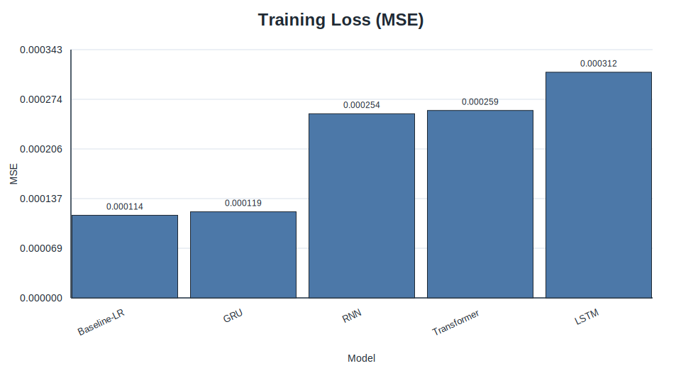

*Figure 1. Training-loss comparison for the best tuned models and baseline.*

### 5.8 Evaluation metrics

Three metrics are reported:

- **MSE:** penalises large forecast errors and is the main optimisation/evaluation criterion.
- **MAE:** provides a scale-consistent average absolute error.
- **Directional Accuracy (DA):** measures the fraction of predictions whose sign matches the realised return.

DA is particularly relevant in finance because a model can sometimes produce modestly inaccurate magnitudes while still being useful for direction-of-move classification.

---

## 6. Experimental Design and Hyperparameter Tuning

### 6.1 Purpose of tuning

Hyperparameter tuning is necessary because model comparisons are not meaningful when architectures are evaluated only at arbitrary default settings. This project uses a staged tuning workflow to search for better-performing configurations using validation MSE as the selection criterion.

### 6.2 Tuning procedure

The tuning process is sequential. For recurrent models, the stages are:

1. learning rate,
2. hidden size,
3. number of layers,
4. batch size.

For the Transformer, the stages are:

1. learning rate,
2. model dimension,
3. number of encoder layers,
4. number of attention heads,
5. batch size.

At each stage, the winning value is frozen before the next parameter group is explored.

### 6.3 Search dimensions by model

The recurrent models and the Transformer do not share identical search spaces because their architectures differ. This is reasonable, but the same validation-based winner-selection rule is applied consistently across all model families.

### 6.4 Best configurations obtained

The final frozen staged winners used in the best-tuned comparison are shown below.

| Model | Final tuned configuration | Validation MSE after final stage |
| --- | --- | ---: |
| LSTM | batch size 32, hidden 128, layers 1, lr 0.0005 | 0.000135338 |
| GRU | batch size 64, hidden 32, layers 3, lr 0.001 | 0.000135147 |
| RNN | batch size 32, hidden 64, layers 2, lr 0.0001 | 0.000140908 |
| Transformer | batch size 32, d_model 32, num_layers 1, nhead 8, lr 0.001 | 0.000140705 |

The tuning archive also shows that the best single archived run for LSTM was obtained very early in the learning-rate sweep, while later sequential stages slightly shifted the final frozen configuration. This is an important methodological detail: the final comparison intentionally uses **staged winners** rather than simply picking the single lowest-loss run from the entire archive.

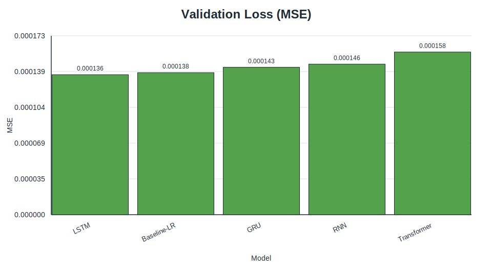

*Figure 2. Validation-loss comparison for the best tuned models and baseline.*

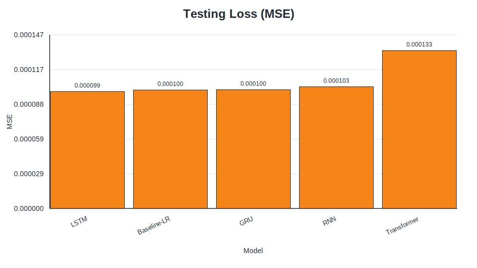

*Figure 3. Test-loss comparison for the best tuned models and baseline.*

### 6.5 Threats to validity in tuning

Sequential tuning is efficient, but it does not exhaustively search hyperparameter interactions. A later parameter sweep can make an earlier frozen choice suboptimal. Therefore, the chosen winners should be interpreted as strong practical settings found under a constrained tuning budget rather than globally optimal architectures.

---

## 7. Results

### 7.1 Final tuned comparison overview

Table 1 summarises the final archived comparison of the tuned neural models and the flattened-sequence linear-regression baseline.

**Table 1. Final archived best-tuned comparison on the shared SPY forecasting task.**

| Rank | Model | Train MSE | Validation MSE | Test MSE | MAE | DA |
| ---: | --- | ---: | ---: | ---: | ---: | ---: |
| 1 | LSTM | 0.000311818 | 0.000135595 | 0.000098719 | 0.006570 | 0.520593 |
| 2 | Baseline-LR | 0.000114153 | 0.000137577 | 0.000100075 | 0.006655 | 0.527183 |
| 3 | GRU | 0.000118986 | 0.000142754 | 0.000100300 | 0.006600 | 0.570016 |
| 4 | RNN | 0.000254451 | 0.000145849 | 0.000102793 | 0.006844 | 0.472817 |
| 5 | Transformer | 0.000258977 | 0.000157518 | 0.000133374 | 0.007735 | 0.542010 |

The main result is that **LSTM achieved the lowest validation and test MSE**, while **Baseline-LR ranked second** and remained very close to LSTM. This is one of the most important findings of the project because it shows that model complexity did not lead to a decisive margin of superiority.

### 7.2 Error-based performance comparison

The LSTM test MSE of 0.000098719 is only slightly lower than the baseline test MSE of 0.000100075. The absolute gap is therefore small. By contrast, the Transformer is clearly behind the recurrent models and the baseline, with a materially worse test MSE of 0.000133374.

This pattern suggests three points:

1. There is some benefit from sequence-aware nonlinear modelling, as the best LSTM run did outperform the baseline.
2. The signal available in 30 lagged SPY returns is weak enough that linear regression remains highly competitive.
3. Not all deep architectures benefit equally from this task; the Transformer seems less well matched to the available data and tuning budget.

### 7.3 Directional accuracy comparison

Directional accuracy does not fully align with MSE rankings. The **GRU** produced the highest DA at **57.00%**, even though its MSE was worse than LSTM and slightly worse than the baseline. This means that the GRU was comparatively better at getting the sign right, even when its predicted magnitudes were not the most accurate.

That divergence matters because it shows why a report should not treat one metric as sufficient. In financial forecasting, a model can be more useful for directional decisions than for magnitude estimation, or vice versa.

### 7.4 Prediction pattern visualisation

The archived scatter and prediction-slice plots provide a qualitative view of model behaviour.

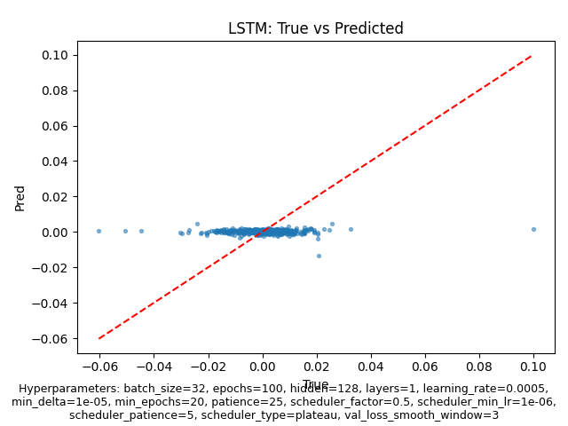

*Figure 4. LSTM predicted-vs-actual scatter plot for the archived best-tuned comparison.*

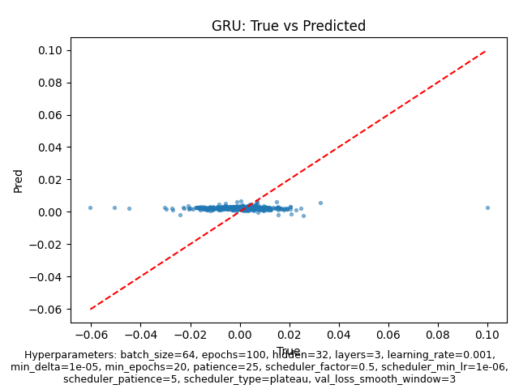

*Figure 5. GRU predicted-vs-actual scatter plot for the archived best-tuned comparison.*

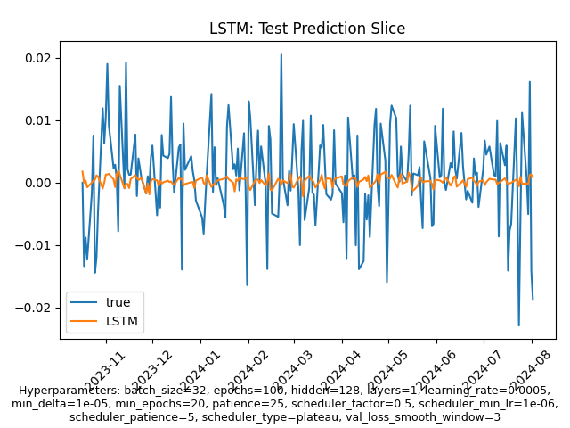

*Figure 6. LSTM prediction slice over a test-set segment.*

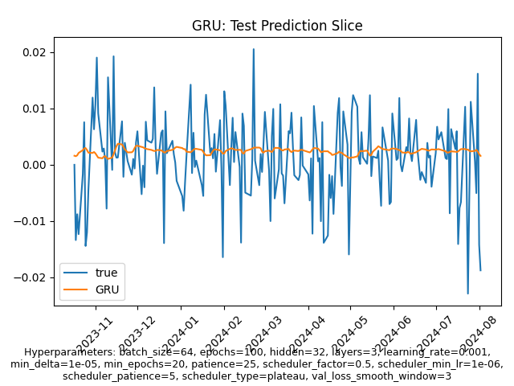

*Figure 7. GRU prediction slice over a test-set segment.*

Qualitatively, the plots show that all models struggle with the full volatility of daily returns, which is expected. The best-performing models appear to track broad movement direction better than precise return magnitude.

### 7.5 Summary of key findings

The final result set supports the following findings:

- **LSTM** is the strongest overall model by validation and test MSE.
- **Baseline-LR** is unexpectedly competitive and nearly matches LSTM.
- **GRU** has the highest directional accuracy among the archived tuned models.
- **Transformer** performs worst by loss in the current archived comparison.

---

## 8. Discussion

### 8.1 Interpretation of the winning model

The LSTM result is consistent with the literature that highlights the value of gated memory in sequence modelling. [1], [2] Relative to a vanilla RNN, the LSTM can preserve and filter temporal information more effectively, which likely helped on the 30-step return window.

### 8.2 Why the baseline remained competitive

The strong baseline result may be the most informative outcome in the report. If a linear model nearly matches the best neural model, the appropriate interpretation is not that neural methods failed, but that the task itself contains limited predictable structure under the chosen feature set. This is entirely plausible for daily equity-index returns, where much of the variation may be close to noise at this horizon. [1], [5], [8]

### 8.3 Error metrics versus directional accuracy

The GRU’s superior directional accuracy but weaker MSE illustrates a meaningful metric trade-off. A model can make slightly larger magnitude errors while still predicting the correct sign more often. For decision-making tasks where direction matters more than calibrated return size, that distinction could be important.

### 8.4 Comparison with expectations from literature

The archived results broadly agree with prior expectations in two ways. First, gated recurrent models outperform a plain RNN, which is consistent with their design motivation. [2], [3] Second, Transformer superiority is not guaranteed on small, noisy, low-dimensional financial datasets. [4], [8] The project therefore supports a cautious reading of recent deep-learning enthusiasm: architecture choice must match the data regime.

### 8.5 Practical meaning of the results

From a practical perspective, the project suggests that LSTM is the best default neural choice for this specific SPY setup, but the very small margin over linear regression warns against overstating the value of added complexity. A practitioner with limited compute or a strong preference for interpretability could plausibly favour the linear baseline and lose little in error performance.

---

## 9. Limitations

### 9.1 Dataset limitations

Only one asset, SPY, is evaluated. This means the findings cannot be assumed to generalise to single stocks, other asset classes, or international markets.

### 9.2 Experimental limitations

The archived report is based on a limited set of recorded runs rather than repeated experiments with mean ± standard deviation. As a result, some observed ranking differences may be sensitive to run-to-run randomness.

### 9.3 Model-comparison limitations

The project focuses on a single canonical setup with a 30-day lookback and 10-day horizon. Other horizons, additional features, or multivariate inputs could materially change the ranking.

### 9.4 External validity limitations

The repository downloads data dynamically from Yahoo Finance. Because market history grows over time and occasional adjustments can occur, future reruns may not reproduce exactly the same sample count or metric values unless the final dataset snapshot is frozen. [11]

### 9.5 Economic limitations

The report evaluates prediction quality, not trading profitability. It does not include transaction costs, slippage, portfolio construction, or risk-adjusted returns. Therefore, the results should not be interpreted as direct evidence of a profitable trading strategy.

---

## 10. Conclusion and Future Work

### 10.1 Conclusion

This project investigated whether neural sequence models improve forecasting of SPY daily log returns under a shared and reproducible benchmark. The final archived comparison shows that **LSTM achieved the best overall loss performance**, with the lowest validation and test MSE among all evaluated models. However, the **linear-regression baseline remained highly competitive**, indicating that the predictive structure available in the chosen input window is modest. The **GRU delivered the strongest directional accuracy**, while the **Transformer underperformed** the recurrent alternatives on the archived result set.

### 10.2 Contributions of the project

The project makes three main contributions:

1. It defines a clear shared forecasting task for SPY daily log returns.
2. It implements a reproducible comparison pipeline across multiple neural architectures and a linear baseline.
3. It provides a staged tuning and reporting workflow that supports evidence-based discussion rather than anecdotal model selection.

### 10.3 Future work

Several extensions would strengthen the study:

- repeated runs with summary statistics,
- walk-forward or rolling-window evaluation,
- additional assets and cross-market tests,
- richer feature sets such as volume, volatility, or macro variables,
- trading simulation with transaction costs,
- more extensive Transformer tuning or financial-specific attention architectures.

Overall, the most defensible conclusion is not that one neural architecture universally dominates, but that **LSTM is the strongest model for the current archived SPY setup while simple baselines remain difficult to beat by a large margin**.

---

## References

[1] T. Fischer and C. Krauss, “Deep learning with long short-term memory networks for financial market predictions,” *European Journal of Operational Research*, vol. 270, no. 2, pp. 654–669, Oct. 2018.

[2] S. Hochreiter and J. Schmidhuber, “Long short-term memory,” *Neural Computation*, vol. 9, no. 8, pp. 1735–1780, 1997.

[3] K. Cho *et al*., “Learning phrase representations using RNN Encoder-Decoder for statistical machine translation,” in *Proc. 2014 Conf. Empirical Methods in Natural Language Processing (EMNLP)*, Doha, Qatar, 2014, pp. 1724–1734.

[4] A. Vaswani *et al*., “Attention is all you need,” in *Advances in Neural Information Processing Systems 30 (NeurIPS 2017)*, 2017, pp. 5998–6008.

[5] R. J. Hyndman and G. Athanasopoulos, *Forecasting: Principles and Practice*, 3rd ed. Melbourne, Australia: OTexts, 2021.

[6] J. L. Elman, “Finding structure in time,” *Cognitive Science*, vol. 14, no. 2, pp. 179–211, 1990.

[7] F. Chollet, *Deep Learning with Python*, 2nd ed. Shelter Island, NY, USA: Manning, 2021.

[8] Z. Zhang, S. Zohren, and S. Roberts, “Deep learning for portfolio optimization,” *The Journal of Financial Data Science*, vol. 2, no. 4, pp. 8–20, 2020.

[9] State Street Global Advisors, “SPDR S&P 500 ETF Trust (SPY),” accessed Mar. 22, 2026. [Online]. Available: https://www.ssga.com/us/en/intermediary/etfs/funds/spdr-sp-500-etf-trust-spy

[10] F. Pedregosa *et al*., “Scikit-learn: Machine learning in Python,” *Journal of Machine Learning Research*, vol. 12, pp. 2825–2830, 2011.

[11] R. Aroussi, “yfinance: Download market data from Yahoo! Finance’s API,” GitHub repository, accessed Mar. 22, 2026. [Online]. Available: https://github.com/ranaroussi/yfinance

[12] D. P. Kingma and J. Ba, “Adam: A method for stochastic optimization,” in *Proc. 3rd Int. Conf. Learning Representations (ICLR)*, San Diego, CA, USA, 2015.

---

## Appendix A. Final tuned configurations

| Model | Tuned hyperparameters | Archived run ID |
| --- | --- | --- |
| LSTM | `{"batch_size": 32, "hidden": 128, "layers": 1, "lr": 0.0005}` | `best_tuned_lstm_comparison-20260320T093214Z` |
| GRU | `{"batch_size": 64, "hidden": 32, "layers": 3, "lr": 0.001}` | `best_tuned_gru_comparison-20260320T093215Z` |
| RNN | `{"batch_size": 32, "hidden": 64, "layers": 2, "lr": 0.0001}` | `best_tuned_rnn_comparison-20260320T093215Z` |
| Transformer | `{"batch_size": 32, "d_model": 32, "lr": 0.001, "nhead": 8, "num_layers": 1}` | `best_tuned_transformer_comparison-20260320T093216Z` |
| Baseline-LR | `{"flattened_sequence": true, "model": "LinearRegression"}` | `best_tuned_lstm_comparison-20260320T093214Z-baseline-lr` |

## Appendix B. Additional figures

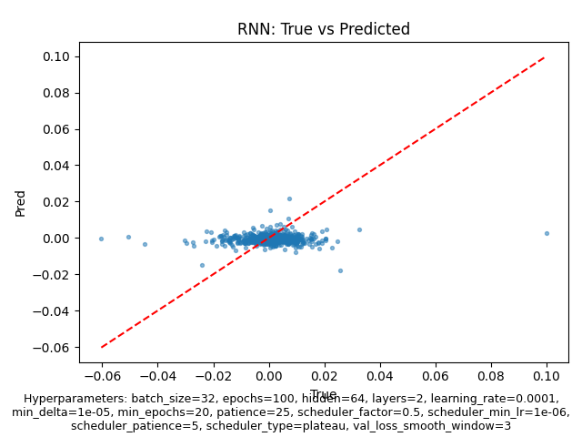

*Figure A1. RNN predicted-vs-actual scatter plot.*

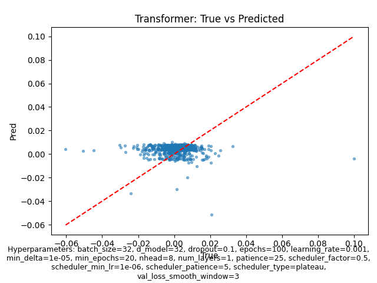

*Figure A2. Transformer predicted-vs-actual scatter plot.*

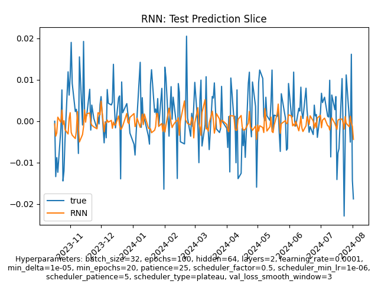

*Figure A3. RNN prediction slice.*

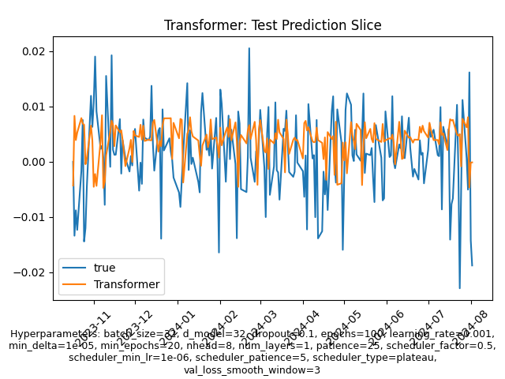

*Figure A4. Transformer prediction slice.*

## Appendix C. Reproducibility notes

The archived best-tuned comparison discussed in this report corresponds to runs dated **2026-03-20 UTC** and uses the staged winners recorded in `reports/tuning_winners.csv`. The experiment log records a git commit of `9a953470255dba340544b395a87656c609920bc7` for the final comparison runs and preserves run IDs, metrics, package versions, and artifact paths for reproducibility.
