## 1. Cover page (Appendix A format)

The Hong Kong Polytechnic University
Department of Computing

COMP4913 Capstone Project
Report (Final)

Financial Time-Series Prediction Using Advanced Neural Network Models

Student Name:
CHAN Cheung Hong
Student ID No.:
22081328D
Programme-Stream Code:
61435-FCS
Supervisor:
Dr Yujie Wu
Co-Examiner:

2nd Assessor:

Submission Date:
31 March 2026

## 2. Abstract

This project benchmarks sequence models for short-horizon forecasting under a unified and reproducible pipeline that now supports **multiple target definitions** and both **real (SPY)** and **synthetic (sine)** data sources. The latest archived final-report bundle (generated at `2026-03-31T20:31:21Z`) evaluates four tasks: `sine_next_day`, `next_return`, `next_volatility`, and `next_mean_return`. Across these tasks, RNN, LSTM, GRU, Transformer, and a flattened-sequence linear-regression baseline are compared on aligned splits using MSE/MAE and directional accuracy (DA).

The cross-task summary shows that **Baseline-LR** is best on `sine_next_day` and `next_volatility`, **LSTM** is best on `next_return`, and **GRU** is best on `next_mean_return`. The best test MSE values are `4.8070e-08` (sine), `9.1979e-05` (next_return), `1.7733e-05` (next_volatility), and `1.5519e-05` (next_mean_return). These outcomes reinforce two conclusions: (1) no single neural architecture dominates all task definitions, and (2) strong linear baselines remain essential in financial-style forecasting benchmarks.

---

## 3. Table of Contents

- 1. Cover page (Appendix A format)
- 2. Abstract
- 3. Table of contents
- 4. List of tables and figures
- 5. Main body
  - Chapter 1. Introduction
  - Chapter 2. Background and Literature Context
  - Chapter 3. Problem Statement and Objectives
  - Chapter 4. Data and Pre-processing
  - Chapter 5. Methodology
  - Chapter 6. Experimental Design and Hyperparameter Tuning
  - Chapter 7. Results
  - Chapter 8. Discussion
  - Chapter 9. Limitations
  - Chapter 10. Conclusion and Future Work
  - Chapter 11. Project Contributions / What Has Been Achieved
- 6. References/Bibliography
- 7. Appendices

## 4. List of Tables and Figures

### Tables

- Table 1. Cross-task consolidated summary.
- Table 2. Updated report artifact map.
- Table A-1. Final tuned configurations (latest bundle highlights).

### Figures

- Figure 1. Training-loss comparison for the best tuned models and baseline.
- Figure 4A-1 to Figure 4D-6. Per-task training/validation/testing, hyperparameter impact, scatter, and prediction-slice visuals.

## 5. Main Body

---

### Chapter 1. Introduction

### 1.1 Project background

Financial time-series forecasting remains a difficult problem because market data are noisy, non-stationary, and often only weakly predictable. Even when useful structure exists, the signal-to-noise ratio is usually small, particularly for return prediction rather than price-level prediction. This challenge has motivated extensive use of machine learning and deep learning methods for sequence modelling, especially recurrent architectures and attention-based models. [1], [5], [8]

This project focuses on a **configurable short-horizon forecasting system** where targets are defined by `target_mode`, `horizon`, and `target_smooth_window`. The final archive includes one synthetic sanity task (`sine_next_day`) and three SPY market tasks (`next_return`, `next_volatility`, `next_mean_return`). SPY remains a reasonable proxy for broad U.S. equity-market behaviour, while the synthetic sine task provides a controlled check that the pipeline behaves sensibly under an easier signal regime. [9]

### 1.2 Problem statement

The core problem is not simply to generate forecasts, but to determine whether more expressive neural sequence models provide a measurable advantage over a simpler baseline when all methods are trained and evaluated on the same prepared dataset. In financial forecasting, complex models can easily appear promising while actually overfitting noisy data. Therefore, a fair shared-split comparison is academically more meaningful than isolated single-model demonstrations. [1], [5]

### 1.3 Research aim

The aim of this project is to benchmark several neural sequence architectures across the implemented task system—covering both the synthetic sanity task and multiple SPY target definitions—and determine whether any of them outperform a flattened-sequence linear-regression baseline in prediction error and directional accuracy under matched splits and preprocessing.

### 1.4 Objectives

The specific objectives are:

1. To construct a reproducible forecasting pipeline for SPY daily log returns.
2. To compare RNN, LSTM, GRU, and Transformer models under shared experimental conditions.
3. To include a linear-regression baseline built from the same lagged input window.
4. To perform staged hyperparameter tuning using validation MSE.
5. To analyse both magnitude-based error metrics and directional accuracy.

### 1.5 Scope of the project

The latest archived report bundle covers four fully populated tasks: `sine_next_day`, `next_return`, `next_volatility`, and `next_mean_return`. Claims in this report are scoped to these definitions, with each task tracked by explicit `task_id`, `target_mode`, `horizon`, and (where applicable) `target_smooth_window`.

### 1.6 Report organisation

The remainder of this report covers background literature, formal task definition, data preparation, methodology, tuning design, results, discussion, limitations, conclusion, and appendices.

---

### Chapter 2. Background and Literature Context

### 2.1 Financial time-series forecasting

Financial forecasting has long been studied through both statistical and machine-learning approaches. A useful distinction is between forecasting prices and forecasting returns. Prices usually contain strong trends and scale effects, whereas returns are closer to stationary and are therefore more appropriate for modelling short-term predictive relationships. However, this also makes the forecasting problem harder because much of the predictable structure has already been removed. [5], [8]

Prior work has shown that deep sequence models can capture nonlinear temporal relationships in financial data, but the size of the advantage depends strongly on the market, target variable, and evaluation design. Fischer and Krauss, for example, demonstrated that LSTM networks can be effective in financial market prediction, while also highlighting the fragility of performance under realistic conditions. [1]

### 2.2 Traditional and machine-learning baselines

A simple linear model remains an important baseline in time-series forecasting because it offers interpretability, low variance, and a useful reference point for judging whether a more complex model actually extracts additional structure. When a neural network only marginally outperforms linear regression, the correct interpretation is usually that the forecasting signal is weak or that the task is close to the limit of what is learnable from the available features. [5], [10]

### 2.3 Recurrent neural networks

Vanilla RNNs explicitly process ordered sequences by updating a hidden state across time steps. This makes them a natural baseline neural architecture for sequential forecasting, but standard RNNs are known to struggle with unstable gradients and limited long-range memory. [2], [6]

### 2.4 LSTM and GRU improvements over vanilla RNN

LSTM networks introduce gated memory cells that help preserve information over longer horizons, making them well suited to sequence tasks where delayed dependencies matter. [2] GRUs provide a related gated mechanism with a simpler parameterisation and often achieve comparable performance with lower computational overhead. [3] In financial forecasting, both architectures are widely used because they offer a better trade-off between expressiveness and trainability than a plain RNN. [1]

### 2.5 Transformer models for sequence learning

Transformers replace recurrence with self-attention, which can model pairwise relationships across all positions in a sequence. This design has achieved outstanding results in natural language processing and many other sequence domains. [4] Nevertheless, Transformer performance depends heavily on dataset scale, architecture choices, and tuning budget. On relatively small financial datasets with limited input dimensionality, the expected advantage over recurrent models is less certain. [4], [8]

### 2.6 Research gap and project positioning

This project is positioned as a controlled benchmark rather than a claim of trading-system superiority. Its contribution is to compare RNN, LSTM, GRU, Transformer, and linear regression under one aligned preprocessing/evaluation workflow across explicitly defined tasks: `sine_next_day` (synthetic sanity), plus SPY `next_return`, `next_volatility`, and `next_mean_return` (market targets). This framing avoids overgeneralising from any single return definition and keeps conclusions tied to concrete `target_mode`/`horizon`/`target_smooth_window` settings.

---

### Chapter 3. Problem Statement and Objectives

### 3.1 Forecasting task definition

The forecasting system is formulated as supervised learning on multifeature sequences. Let `f_t in R^8` denote the engineered feature vector at day `t`, and let each sample be a rolling lookback window:

```text
X_t = [f_{t-L+1}, ..., f_t]
```

where `L` is the sequence length (`seq_len`, tuned per task/model). The repository supports multiple targets via `target_mode`:

- `sine_next_day` (synthetic sanity task),
- `next_return` (1-step return),
- `next_volatility` (forward rolling volatility),
- `next_mean_return` (forward rolling mean return),
- plus default/general modes such as `horizon_return`.

The latest final-report archive evaluates these four task IDs:

1. `sine_next_day` (`data_source=sine`, `horizon=1`, `target_smooth_window=1`),
2. `next_return` (`data_source=spy`, `horizon=1`, `target_smooth_window=1`),
3. `next_volatility` (`data_source=spy`, `horizon=1`, `target_smooth_window=5`),
4. `next_mean_return` (`data_source=spy`, `horizon=1`, `target_smooth_window=5`).

### 3.2 Research questions

The report addresses the following research questions:

1. Which neural architecture performs best under the shared pipeline when evaluated task-by-task (`sine_next_day`, `next_return`, `next_volatility`, `next_mean_return`)?
2. How do model rankings differ between the synthetic sanity task (`sine_next_day`) and the SPY market tasks (`next_return`, `next_volatility`, `next_mean_return`)?
3. Does a tuned neural model outperform the linear-regression baseline within each task definition rather than only on a single return target?
4. Is lower MSE associated with better directional accuracy across these task definitions?

### 3.3 Project objectives

The technical objective is to produce an apples-to-apples comparison with common data preparation, common split boundaries, common evaluation metrics, and validation-driven model selection.

### 3.4 Success criteria

A model is considered successful if it demonstrates lower validation and test error than alternatives under the shared setup. However, because financial forecasting is often used for directional decisions, directional accuracy is also reported as a complementary metric rather than relying on MSE alone.

---

### Chapter 4. Data and Pre-processing

### 4.1 Data source and asset selection

The latest report bundle evaluates both **synthetic** and **market** tasks. For market tasks, data are downloaded from Yahoo Finance through `yfinance` with SPY as the instrument and repository default `START=2005-01-01`. In parallel, the `sine_next_day` task uses the repository’s generated sine-series feature frame as a controlled sanity benchmark. [9], [11]

### 4.2 Return definition

The raw downloaded close series is converted to **daily log returns**:

```text
r_t = log(P_t / P_{t-1})
```

Using returns instead of prices reduces scale effects and makes the target more appropriate for short-horizon statistical learning. [5]

### 4.3 Sequence construction

For neural models, the repository builds three-dimensional input tensors of shape `(N, seq_len, 8)`, where each sample contains `seq_len` consecutive days of 8 engineered features and one scalar target. The tuned search space includes `seq_len ∈ {20, 30, 60}` in `src/tuning/main.py`.

The 8 engineered features produced by `build_spy_feature_frame` are:

1. `log_ret`
2. `oc_ret`
3. `hl_range`
4. `vol_chg`
5. `ma_5_gap`
6. `ma_20_gap`
7. `volatility_5`
8. `volatility_20`

Target construction is controlled by `target_mode`, `horizon`, and `target_smooth_window`. In the latest archived bundle, the evaluated tasks are `sine_next_day`, `next_return`, `next_volatility` (`target_smooth_window=5`), and `next_mean_return` (`target_smooth_window=5`).

For transparency, the archived best-tuned comparisons use the following winning `seq_len` values by task (best test-MSE run per task):

| Task               | Best test-MSE winner | Winning `seq_len` |
| ------------------ | -------------------- | ----------------: |
| `sine_next_day`    | Baseline-LR          |                30 |
| `next_return`      | LSTM                 |                30 |
| `next_volatility`  | Baseline-LR          |                20 |
| `next_mean_return` | GRU                  |                30 |

### 4.4 Train/validation/test split

Splitting is chronological rather than random for all tasks, preventing future information leakage into training. The same train/validation/test protocol is applied consistently across the four archived tasks in `reports/final_report_tasks/20260331T192814Z`.

### 4.5 Normalisation and leakage prevention

The input sequences are standardised with `StandardScaler`, fitted only on the training inputs and then applied to validation and test sets. This avoids information leakage from future periods into the training transformation pipeline, which would otherwise bias the evaluation. [5], [10]

---

### Chapter 5. Methodology

### 5.1 Overall pipeline

All models share the same high-level pipeline:

1. Download SPY historical data.
2. Compute daily log returns.
3. Build aligned input sequences with 8 features per step and a task-specific configured target (`sine_next_day`, `next_return`, `next_volatility`, or `next_mean_return`).
4. Split the data chronologically into training, validation, and test sets.
5. Fit the scaler on training inputs only.
6. Train each model using validation-based checkpoint selection.
7. Compare the final archived runs using MSE, MAE, and directional accuracy.

### 5.2 Baseline model

The baseline is a flattened-sequence **linear regression** model. It uses the same multifeature `seq_len` window as the neural models, but reshapes each `(seq_len, 8)` sequence into a tabular vector (`seq_len × 8` features) so the target alignment remains identical. This baseline tests whether nonlinear sequence modelling provides gains beyond a strong linear model on the same information set. [5], [10]

### 5.3 RNN model

The vanilla RNN model consists of a recurrent layer over the `seq_len` input sequence followed by a linear output layer that maps the last hidden state to a scalar forecast. This architecture serves as the simplest neural sequence benchmark. [6]

### 5.4 LSTM model

The LSTM model replaces the simple recurrent cell with gated memory units and again uses the last sequence output to produce a one-step scalar prediction. The expectation from literature is that LSTM should be better able to preserve useful information over the lookback window. [1], [2]

### 5.5 GRU model

The GRU model is structurally similar to the LSTM model but uses update and reset gates with fewer parameters. It is included to test whether a lighter gated recurrent architecture can match or exceed LSTM on this task. [3]

### 5.6 Transformer model

The Transformer model first projects each 8-dimensional timestep feature vector into a learned embedding space, adds positional encodings, applies stacked Transformer encoder layers, and uses the final time-step representation for scalar prediction. This architecture is intended to test whether self-attention can outperform recurrence on this multifeature financial sequence problem. [4]

### 5.7 Mathematical Formulation of Models

To make the notation easier to read, this section focuses on the **core equations that are directly used in the project**, and explains each formula in plain language.

For every sample, the input is a lookback window with `L = seq_len` days and `F = 8` features per day:

```text
X_t = [x_{t-L+1}, ..., x_t],    x_tau in R^F
```

The model outputs a scalar forecast `y_hat_t`, and training minimises mean squared error over the training set:

```text
MSE = (1/N) sum_{t=1..N} (y_t - y_hat_t)^2
```

#### 5.7.1 Baseline-LR (used in final benchmark)

The linear baseline first flattens the sequence window into one vector and then applies linear regression:

```text
y_hat_t = w^T vec(X_t) + b
```

where `vec(X_t) in R^(L*F)`, `w in R^(L*F)`, and `b in R`.  
In words, the baseline treats all lagged features as one tabular input and learns a single linear mapping to the target.

#### 5.7.2 Vanilla RNN (used in final benchmark)

The RNN updates a hidden state step by step through the window:

```text
h_tau = tanh(W_x x_tau + W_h h_{tau-1} + b_h)
y_hat_t = W_o h_t + b_o
```

The hidden state `h_tau` carries historical information forward across time.

#### 5.7.3 LSTM (used in final benchmark)

LSTM extends the RNN with gates and a memory cell:

```text
i_tau = sigmoid(W_i[x_tau; h_{tau-1}] + b_i)
f_tau = sigmoid(W_f[x_tau; h_{tau-1}] + b_f)
g_tau = tanh(W_g[x_tau; h_{tau-1}] + b_g)
o_tau = sigmoid(W_o[x_tau; h_{tau-1}] + b_o)
c_tau = f_tau * c_{tau-1} + i_tau * g_tau
h_tau = o_tau * tanh(c_tau)
y_hat_t = W_y h_t + b_y
```

`i_tau`, `f_tau`, and `o_tau` are the input/forget/output gates. The cell state `c_tau` is the long-memory path that helps LSTM remain stable on longer dependencies.

#### 5.7.4 GRU (used in final benchmark)

GRU uses two gates instead of three:

```text
z_tau = sigmoid(W_z[x_tau; h_{tau-1}] + b_z)
r_tau = sigmoid(W_r[x_tau; h_{tau-1}] + b_r)
h_tilde_tau = tanh(W_h[x_tau; r_tau * h_{tau-1}] + b_h)
h_tau = (1 - z_tau) * h_{tau-1} + z_tau * h_tilde_tau
y_hat_t = W_y h_t + b_y
```

The update gate `z_tau` controls how much new information is written into the hidden state, while `r_tau` controls how strongly past state is used when building the candidate state.

#### 5.7.5 Transformer (used in final benchmark)

Inside each encoder layer, self-attention is computed as:

```text
Attention(Q, K, V) = softmax(QK^T / sqrt(d_k)) V
```

with `Q = XW_Q`, `K = XW_K`, and `V = XW_V`. After positional encoding and stacked encoder blocks, the final representation is mapped to the forecast:

```text
y_hat_t = W_h z_t + b_h
```

where `z_t` is the final sequence representation used by the prediction head.

#### 5.7.6 Classical models for context (not part of final benchmark)

Earlier drafts discussed ARIMA/SARIMA and exponential smoothing as background references. They are useful conceptual baselines in time-series literature, but the final empirical comparison in this project is limited to Baseline-LR, RNN, LSTM, GRU, and Transformer under one shared pipeline.

### 5.8 Configuration source of truth

Repository-level defaults (for example `HORIZON=1`, `TARGET_MODE=horizon_return`) are defined in `src/common/config.py`. Run-specific overrides (including CLI overrides such as `--horizon` and `--target-mode`) are resolved through `src/common/runtime_config.py` and then passed into experiment preparation, so archived experiments may intentionally differ from defaults.

For this report, the **archived final metrics are taken from runtime-resolved experiment configs** (effective CLI + staged-winner selections), **not** from static defaults in `src/common/config.py`. Concretely, run truth is read from `reports/final_report_tasks/20260331T192814Z/tuning_winners.csv`, per-task `reports/final_report_tasks/20260331T192814Z/*/best_tuned_comparison_*.md`, and the bundle-level synthesis `reports/final_report_tasks/20260331T192814Z/overall_task_summary.md`.

### 5.9 Training strategy

The training workflow uses the Adam optimiser, mean squared error loss, early stopping with validation-loss smoothing, checkpointing of the best validation state, and scheduler-based learning-rate reduction. Hyperparameter selection is validation-driven, and the final archived best-tuned comparison was generated from the frozen winners stored in `tuning_winners.csv`. [12]

Figure 1 is included to demonstrate that the tuned pipeline produces stable convergence patterns before the report interprets task-specific winners.

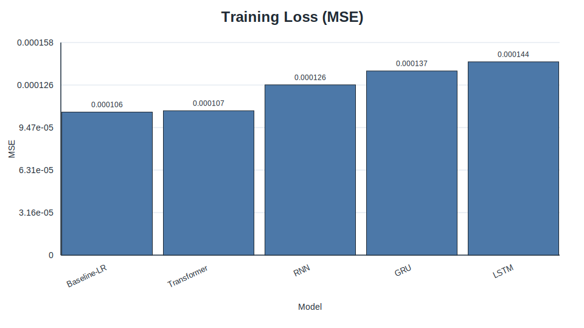

_Figure 1. Training-loss comparison for the best tuned models and baseline._

- **Why this chart is included:** Tests whether model optimisation remains stable and comparable across architectures.
- **What it shows:** All tuned models converge, but with distinct loss levels across families.
- **Conclusion supported:** Supports the report’s model-comparison setup and motivates deeper task-level result analysis.

### 5.10 Evaluation metrics

Three metrics are reported:

- **MSE:** penalises large forecast errors and is the main optimisation/evaluation criterion.
- **MAE:** provides a scale-consistent average absolute error.
- **Directional Accuracy (DA):** measures the fraction of predictions whose sign matches the realised return.

DA is particularly relevant in finance because a model can sometimes produce modestly inaccurate magnitudes while still being useful for direction-of-move classification.

However, DA must be interpreted **by `target_mode`** rather than as a uniform cross-task score. For signed return-style targets (for example `next_return` and `next_mean_return`), DA is meaningfully discriminative because the sign directly encodes up/down direction. For level-like or strictly non-negative targets (especially `next_volatility`, defined from rolling standard deviation), sign-based DA is not a discriminative metric and can quickly saturate near a ceiling. Therefore, on `next_volatility`, model ranking should prioritise **MSE/MAE** and treat DA only as a weak supplementary indicator.

---

### Chapter 6. Experimental Design and Hyperparameter Tuning

### 6.1 Purpose of tuning

Hyperparameter tuning is necessary because model comparisons are not meaningful when architectures are evaluated only at arbitrary default settings. This project uses a staged tuning workflow to search for better-performing configurations using validation MSE as the selection criterion.

### 6.2 Tuning procedure

The tuning process is sequential. For recurrent models, the stages are:

1. learning rate,
2. hidden size,
3. number of layers,
4. batch size.

For the Transformer, the stages are:

1. learning rate,
2. model dimension,
3. number of encoder layers,
4. number of attention heads,
5. batch size.

At each stage, the winning value is frozen before the next parameter group is explored.

### 6.3 Search dimensions by model

The recurrent models and the Transformer do not share identical search spaces because their architectures differ. This is reasonable, but the same validation-based winner-selection rule is applied consistently across all model families.

### 6.4 Best configurations obtained

The latest archive contains task-specific tuned winners rather than one global best configuration. Cross-task winners by test MSE are:

| task_id            | Winner      |          Best test MSE |
| ------------------ | ----------- | ---------------------: |
| `sine_next_day`    | Baseline-LR |  4.807035774110167e-08 |
| `next_return`      | LSTM        |  9.197905455948785e-05 |
| `next_volatility`  | Baseline-LR | 1.7733482060336406e-05 |
| `next_mean_return` | GRU         | 1.5519119187956676e-05 |

This confirms that tuning outcomes are task-dependent and should be interpreted per `task_id`.

### 6.5 Threats to validity in tuning

Sequential tuning is efficient, but it does not exhaustively search hyperparameter interactions. A later parameter sweep can make an earlier frozen choice suboptimal. Therefore, the chosen winners should be interpreted as strong practical settings found under a constrained tuning budget rather than globally optimal architectures.

---

### Chapter 7. Results

This chapter reports outcomes by **task**, where each task is identified by `task_id` and defined by `target_mode` + `horizon` (+ `target_smooth_window` where applicable).

### 7.1 Cross-task consolidated summary

Table 1 summarises the best-tuned winner for each task from `overall_task_summary.md`.

| Task   | task_id            | target_mode        | horizon | target_smooth_window | Best model (test MSE) |          Best test MSE |
| ------ | ------------------ | ------------------ | ------: | -------------------: | --------------------- | ---------------------: |
| Task A | `sine_next_day`    | `sine_next_day`    |       1 |                    1 | Baseline-LR           |  4.807035774110167e-08 |
| Task B | `next_return`      | `next_return`      |       1 |                    1 | LSTM                  |  9.197905455948785e-05 |
| Task C | `next_volatility`  | `next_volatility`  |       1 |                    5 | Baseline-LR           | 1.7733482060336406e-05 |
| Task D | `next_mean_return` | `next_mean_return` |       1 |                    5 | GRU                   | 1.5519119187956676e-05 |

### 7.2 Per-task tuned comparison highlights

The consolidated table gives the headline winners, but the important point is **why** they differ by task. On the synthetic `sine_next_day` task, the signal is smooth and highly structured, so both linear and recurrent models fit very well; in this regime, Baseline-LR edges out the neural models in test MSE (`4.8070e-08`), while LSTM still achieves very high directional agreement. This indicates that model capacity is not the main bottleneck when the underlying pattern is simple.

On `next_return`, which is noisier and harder, the best result shifts to LSTM (`9.1979e-05`), with GRU extremely close (`9.2194e-05`). Here, gated recurrence appears to help capture weak short-term dependencies better than both plain RNN and the flattened linear baseline (`1.2176e-04`), although the margin is still modest. The interpretation is therefore not “LSTM always wins,” but “LSTM is most effective for this specific target definition under this data regime.”

The ranking changes again for `next_volatility` and `next_mean_return`, which reinforces the task-conditioned conclusion. For `next_volatility`, Baseline-LR is best (`1.7733e-05`) and GRU is the strongest neural alternative (`1.9411e-05`); because this target is non-negative and smooth, sign-based DA is less informative and error magnitude should drive interpretation. For `next_mean_return`, GRU becomes the winner (`1.5519e-05`), with LSTM and RNN close behind, suggesting that moderate recurrent gating can help on smoothed return targets while still leaving only limited room over simpler baselines.

### 7.3 Updated report artifact map

| Task   | `task_id`          | Comparison report                                                                                         | Figures directory                                                       |
| ------ | ------------------ | --------------------------------------------------------------------------------------------------------- | ----------------------------------------------------------------------- |
| Task A | `sine_next_day`    | `reports/final_report_tasks/20260331T192814Z/sine_next_day/best_tuned_comparison_sine_next_day.csv`       | `reports/final_report_tasks/20260331T192814Z/sine_next_day/figures/`    |
| Task B | `next_return`      | `reports/final_report_tasks/20260331T192814Z/next_return/best_tuned_comparison_next_return.csv`           | `reports/final_report_tasks/20260331T192814Z/next_return/figures/`      |
| Task C | `next_volatility`  | `reports/final_report_tasks/20260331T192814Z/next_volatility/best_tuned_comparison_next_volatility.csv`   | `reports/final_report_tasks/20260331T192814Z/next_volatility/figures/`  |
| Task D | `next_mean_return` | `reports/final_report_tasks/20260331T192814Z/next_mean_return/best_tuned_comparison_next_mean_return.csv` | `reports/final_report_tasks/20260331T192814Z/next_mean_return/figures/` |

### 7.4 Prediction pattern visualisation (updated figures)

This section now places each figure immediately after the paragraph that states why it is needed, and each figure includes a fixed interpretation template.

#### Task A — `sine_next_day`

Figure 4A-1 is included to compare optimisation behaviour across all tuned models on the easiest synthetic-style target before interpreting winner quality.


_Figure 4A-1. Best-tuned training-loss comparison for `sine_next_day`._

- **Why this chart is included:** Tests whether training dynamics are stable and consistently low across candidate models.
- **What it shows:** Loss trajectories converge quickly for all contenders, with small separation after early epochs.
- **Conclusion supported:** Training-only behaviour does not by itself distinguish a dominant model; validation/testing evidence is required.

Figure 4A-2 is included to identify which tuned model generalises best on validation data for `sine_next_day`.

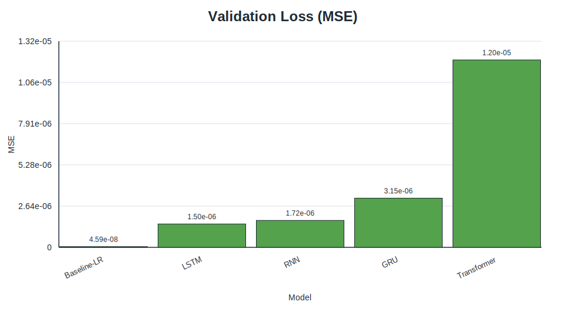

_Figure 4A-2. Best-tuned validation-loss comparison for `sine_next_day`._

- **Why this chart is included:** Evaluates the main model-selection signal used during tuning.
- **What it shows:** Validation losses are tightly grouped, with baseline and top recurrent models near the floor.
- **Conclusion supported:** Confirms that multiple model classes can generalise well on this task, explaining close final rankings.

Figure 4A-3 is included to verify out-of-sample error ranking on the held-out test split for Task A.

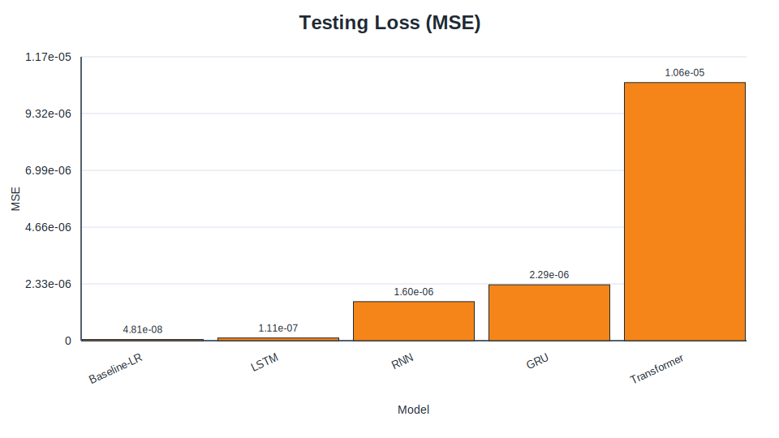

_Figure 4A-3. Best-tuned testing-loss comparison for `sine_next_day`._

- **Why this chart is included:** Tests whether validation winners remain strong on truly unseen data.
- **What it shows:** The baseline remains extremely competitive and reaches the best test-loss region.
- **Conclusion supported:** Supports the claim that Baseline-LR wins Task A despite strong neural alternatives.

Figure 4A-4 is included to show whether stage-wise tuning changed model performance materially in `sine_next_day`.


_Figure 4A-4. Hyperparameter-impact model-loss summary for `sine_next_day`._

- **Why this chart is included:** Assesses whether tuning stages generated meaningful gains versus defaults.
- **What it shows:** Performance shifts are present but modest, with diminishing returns after early stage improvements.
- **Conclusion supported:** Supports using constrained staged tuning as sufficient for this task.

Figure 4A-5 is included to test calibration and bias patterns of the best neural model’s predictions.


_Figure 4A-5. LSTM predicted-vs-actual scatter for `sine_next_day` tuned comparison._

- **Why this chart is included:** Checks linear agreement and dispersion between predictions and realised targets.
- **What it shows:** Points cluster close to the identity trend with limited spread at this scale.
- **Conclusion supported:** Indicates the tuned LSTM is well calibrated, even though baseline error remains slightly better.

Figure 4A-6 is included to inspect local temporal fit quality and lag/overshoot behaviour in a contiguous slice.


_Figure 4A-6. LSTM prediction slice for `sine_next_day` tuned comparison._

- **Why this chart is included:** Verifies whether pointwise fit remains visually consistent over time.
- **What it shows:** Predicted and actual series track closely with small local deviations.
- **Conclusion supported:** Supports the claim that neural models fit Task A well, even when not the absolute winner by MSE.

#### Task B — `next_return`

Figure 4B-1 is included to compare training convergence behaviour for the harder real-market `next_return` target.


_Figure 4B-1. Best-tuned training-loss comparison for `next_return`._

- **Why this chart is included:** Tests whether all models optimise stably under noisy return supervision.
- **What it shows:** Convergence occurs for all models, but final training-loss gaps remain visible.
- **Conclusion supported:** Suggests capacity/inductive-bias differences matter more here than in Task A.

Figure 4B-2 is included to compare validation generalisation before final test claims are made for Task B.

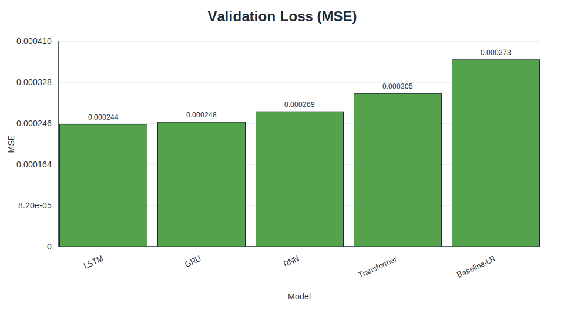

_Figure 4B-2. Best-tuned validation-loss comparison for `next_return`._

- **Why this chart is included:** Provides the direct basis for tuned-winner selection.
- **What it shows:** LSTM and GRU remain near the best validation-loss region, ahead of weaker candidates.
- **Conclusion supported:** Supports the shortlist of recurrent winners for final out-of-sample comparison.

Figure 4B-3 is included to validate final model ranking on held-out test data for `next_return`.

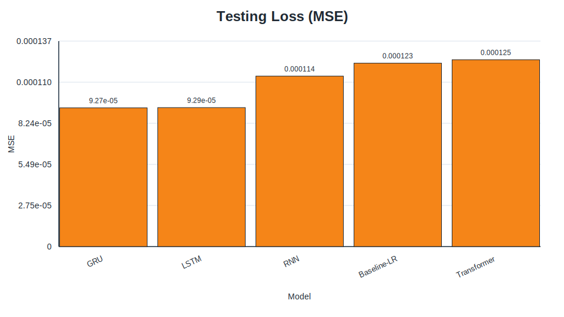

_Figure 4B-3. Best-tuned testing-loss comparison for `next_return`._

- **Why this chart is included:** Tests whether validation ranking transfers to test performance.
- **What it shows:** LSTM is best, GRU is a close second, and baseline is competitive but weaker.
- **Conclusion supported:** Directly supports the report claim that LSTM is the Task B winner.

Figure 4B-4 is included to examine whether hyperparameter stages produced meaningful improvements for each architecture.

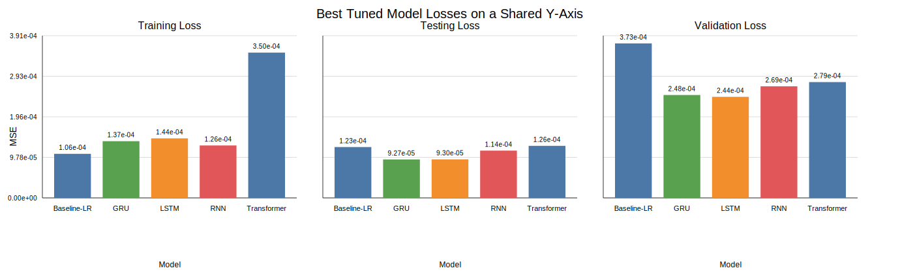

_Figure 4B-4. Hyperparameter-impact model-loss summary for `next_return`._

- **Why this chart is included:** Tests sensitivity of model quality to staged tuning choices.
- **What it shows:** Certain stage choices noticeably reduce loss, with gains varying by model class.
- **Conclusion supported:** Justifies reporting tuned results instead of defaults-only comparisons.

Figure 4B-5 is included to inspect prediction calibration of the winning LSTM on noisy signed returns.


_Figure 4B-5. LSTM predicted-vs-actual scatter for `next_return` tuned comparison._

- **Why this chart is included:** Evaluates agreement pattern and dispersion for the selected winner.
- **What it shows:** Scatter is wider than Task A, but still centred with usable trend alignment.
- **Conclusion supported:** Supports a realistic performance claim: useful but imperfect predictability in daily returns.

Figure 4B-6 is included to inspect sequence-level fit quality and turning-point tracking for the winner.


_Figure 4B-6. LSTM prediction slice for `next_return` tuned comparison._

- **Why this chart is included:** Checks practical temporal tracking behaviour beyond aggregate metrics.
- **What it shows:** The model captures broad movement while smoothing some sharp local swings.
- **Conclusion supported:** Supports the limitation that fine-grained return spikes remain difficult to model.

#### Task C — `next_volatility`

Figure 4C-1 is included to compare optimisation behaviour for volatility forecasting candidates.

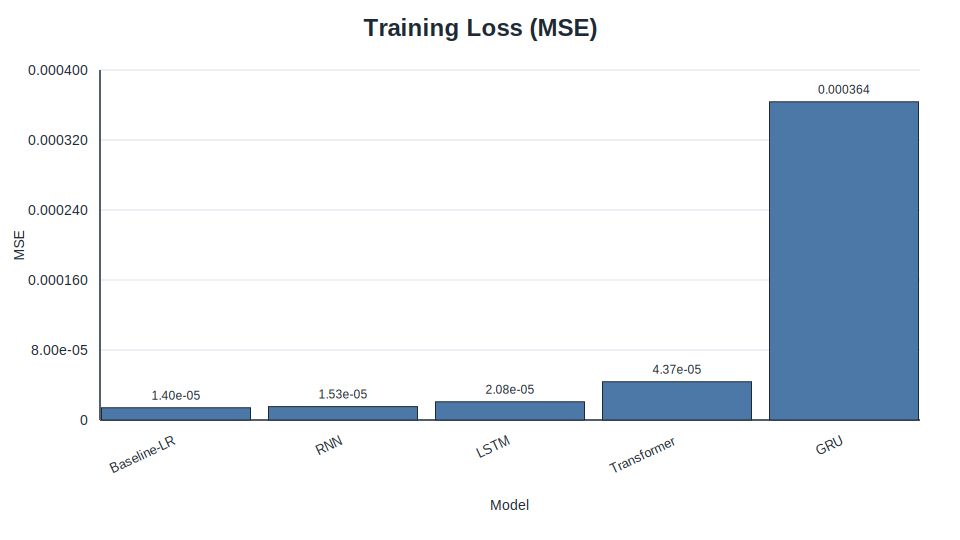

_Figure 4C-1. Best-tuned training-loss comparison for `next_volatility`._

- **Why this chart is included:** Tests whether models can fit the smoother non-negative volatility target.
- **What it shows:** Training losses are low and relatively stable across models.
- **Conclusion supported:** Indicates this task is learnable by both linear and neural models under tuned settings.

Figure 4C-2 is included to evaluate validation ranking for volatility generalisation quality.

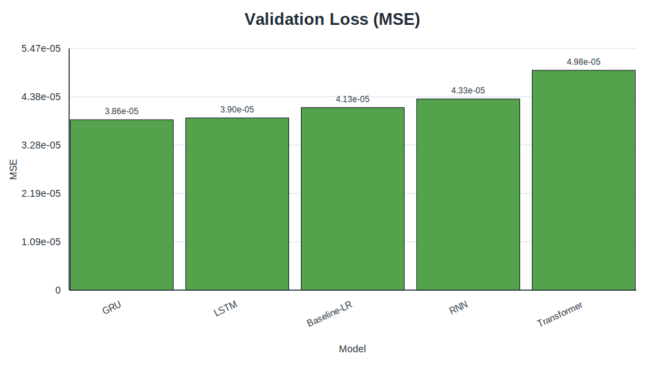

_Figure 4C-2. Best-tuned validation-loss comparison for `next_volatility`._

- **Why this chart is included:** Provides the selection signal for tuned model comparison.
- **What it shows:** Baseline and top neural candidates occupy closely spaced low-loss bands.
- **Conclusion supported:** Supports the interpretation that simpler models can remain competitive on smoother targets.

Figure 4C-3 is included to confirm final held-out ranking for `next_volatility`.

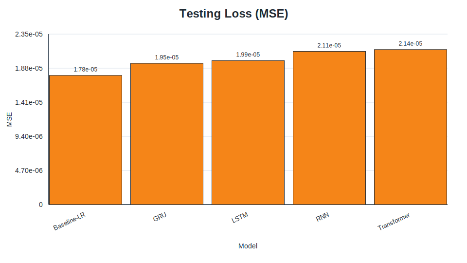

_Figure 4C-3. Best-tuned testing-loss comparison for `next_volatility`._

- **Why this chart is included:** Tests whether validation findings persist out of sample.
- **What it shows:** Baseline-LR attains the best test loss, with GRU the strongest neural model.
- **Conclusion supported:** Supports the claim that Baseline-LR wins Task C.

Figure 4C-4 is included to assess how much staged hyperparameter tuning changed volatility results.

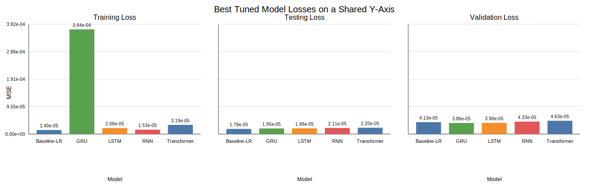

_Figure 4C-4. Hyperparameter-impact model-loss summary for `next_volatility`._

- **Why this chart is included:** Evaluates the marginal value of each tuning stage.
- **What it shows:** Improvements exist but are moderate, with architecture-dependent sensitivity.
- **Conclusion supported:** Supports constrained-tuning practicality and the strong baseline interpretation.

Figure 4C-5 is included to inspect calibration of the best neural (GRU) predictions against realised volatility levels.

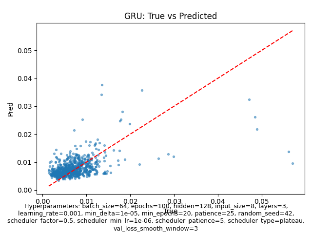

_Figure 4C-5. GRU predicted-vs-actual scatter for `next_volatility` tuned comparison._

- **Why this chart is included:** Tests concentration and bias around realised non-negative targets.
- **What it shows:** Predictions cluster along the main trend with compression at extreme values.
- **Conclusion supported:** Supports a limitation: tail volatility magnitudes are harder to match precisely.

Figure 4C-6 is included to inspect contiguous volatility tracking over time for the best neural model.

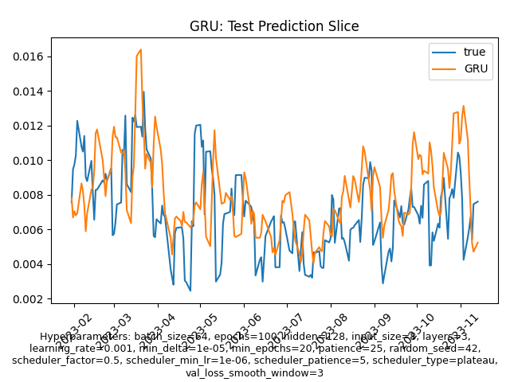

_Figure 4C-6. GRU prediction slice for `next_volatility` tuned comparison._

- **Why this chart is included:** Checks whether temporal smoothing still follows major regime movements.
- **What it shows:** The prediction curve tracks broad volatility shifts with smoother peaks.
- **Conclusion supported:** Supports the claim that MSE/MAE are more informative than DA for this target.

#### Task D — `next_mean_return`

Figure 4D-1 is included to compare training dynamics for moving-average return forecasting.

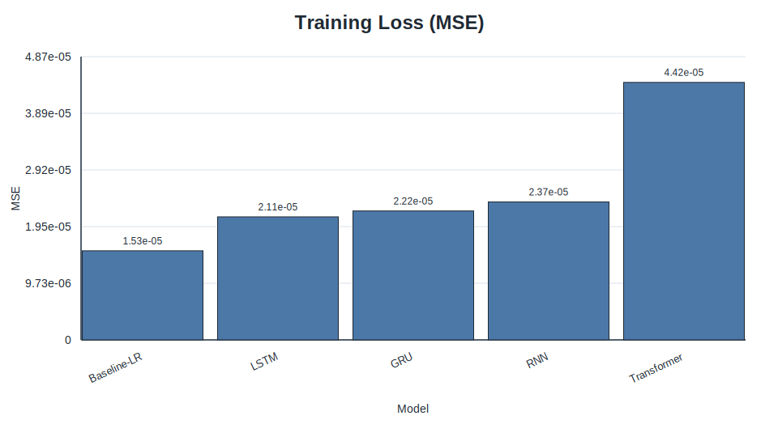

_Figure 4D-1. Best-tuned training-loss comparison for `next_mean_return`._

- **Why this chart is included:** Tests convergence and optimisation stability across tuned models.
- **What it shows:** Recurrent candidates reach low training losses with visible but modest separation.
- **Conclusion supported:** Indicates recurrent architectures have favourable fit dynamics on this smoothed target.

Figure 4D-2 is included to compare validation generalisation before reporting final test rankings.

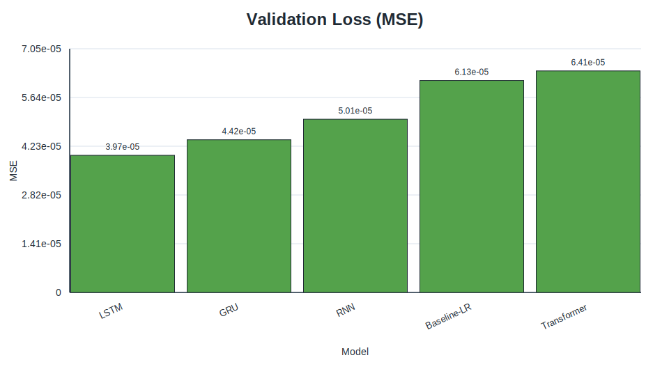

_Figure 4D-2. Best-tuned validation-loss comparison for `next_mean_return`._

- **Why this chart is included:** Provides the tuned model-selection evidence.
- **What it shows:** GRU and nearby recurrent models occupy the lowest validation-loss range.
- **Conclusion supported:** Supports choosing GRU-family recurrent settings for final evaluation focus.

Figure 4D-3 is included to confirm held-out ranking for the smoothed return task.

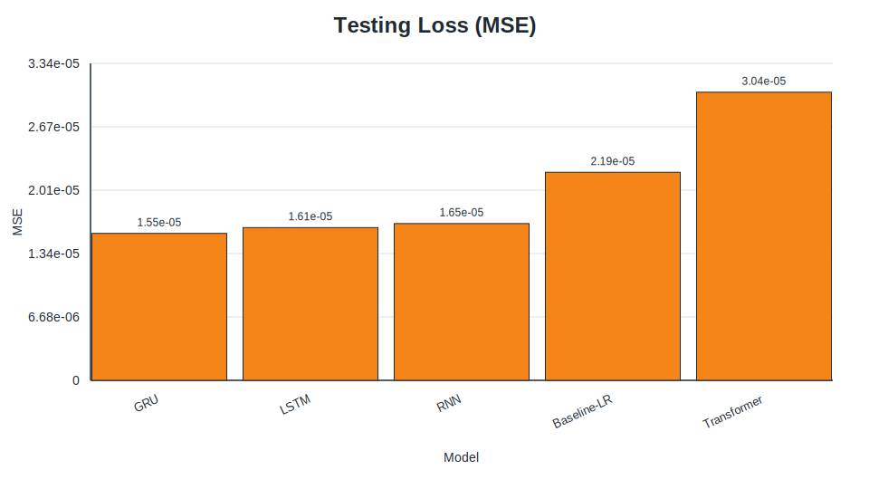

_Figure 4D-3. Best-tuned testing-loss comparison for `next_mean_return`._

- **Why this chart is included:** Tests whether selected winners maintain advantage on unseen data.
- **What it shows:** GRU has the lowest test loss, with LSTM and RNN close behind.
- **Conclusion supported:** Supports the claim that GRU is the Task D winner.

Figure 4D-4 is included to quantify hyperparameter-stage impact on final loss outcomes.

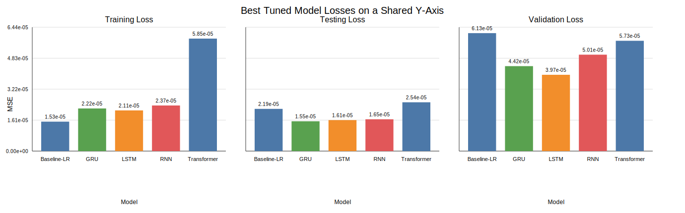

_Figure 4D-4. Hyperparameter-impact model-loss summary for `next_mean_return`._

- **Why this chart is included:** Tests whether staged tuning materially improved each model family.
- **What it shows:** Tuning improves results, with gains concentrated in specific stage transitions.
- **Conclusion supported:** Supports the methodological claim that stage-wise tuning was consequential.

Figure 4D-5 is included to inspect calibration quality for the GRU winner on averaged signed returns.

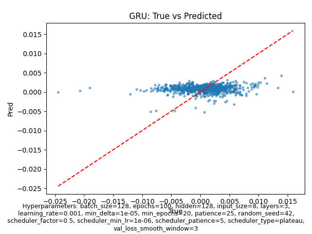

_Figure 4D-5. GRU predicted-vs-actual scatter for `next_mean_return` tuned comparison._

- **Why this chart is included:** Evaluates correlation structure and spread for winner predictions.
- **What it shows:** Points follow the central trend with moderate residual dispersion.
- **Conclusion supported:** Supports the claim that GRU provides the strongest overall error balance on Task D.

Figure 4D-6 is included to check time-local alignment and lag behaviour for GRU predictions.


_Figure 4D-6. GRU prediction slice for `next_mean_return` tuned comparison._

- **Why this chart is included:** Tests whether temporal behaviour supports quantitative winner claims.
- **What it shows:** Predicted movement follows direction changes with mild smoothing around peaks/troughs.
- **Conclusion supported:** Supports using GRU as the preferred model for `next_mean_return`, with expected smoothing limitations.

### 7.5 Summary of key findings

Taken together, the results support three clear conclusions. First, there is no globally best architecture across all four tasks: winner identity changes with target definition. Second, the linear baseline is not a weak comparator; it wins two tasks and remains competitive on the others, which means any neural gain must be interpreted carefully rather than assumed. Third, recurrent gated models (LSTM/GRU) are still the most reliable neural choices in this project, but their advantage is conditional on the target construction and the amount of exploitable structure in the data.


---

### Chapter 8. Discussion

### 8.1 Interpreting what the model winners really mean

A key message from the results is that “best model” is a property of the task setup, not a permanent label attached to one architecture. When the target is smoother or close to linear in the engineered features, Baseline-LR can match or surpass deeper models. When the target is noisier but still contains short-memory nonlinear structure, gated recurrent models—especially LSTM and GRU—tend to move to the front. This is why the four tasks should be read as four related but distinct forecasting problems rather than as repetitions of the same experiment.

### 8.2 Relationship to the earlier models and training process

The earlier model discussion in Chapters 2 and 5 helps explain these outcomes. Vanilla RNN provides the simplest recurrent reference, but its training is usually less stable on noisy sequences than gated variants. LSTM and GRU introduce explicit gating, which improves trainability and memory control; this is consistent with their stronger performance in `next_return` and `next_mean_return`. The Transformer is powerful in principle, but in this project’s setting—relatively limited data scale and low feature dimensionality—its added flexibility does not automatically convert to lower out-of-sample error. Importantly, all models were trained under the same chronological split, scaler discipline, and validation-driven tuning workflow, so the ranking differences are more likely to reflect model-task fit than pipeline inconsistency.

### 8.3 How to read MSE, MAE, and directional accuracy together

MSE and MAE describe magnitude error, while DA describes sign agreement; they answer different questions. For signed targets such as `next_return` and `next_mean_return`, DA adds useful information about directional usefulness. For non-negative targets such as `next_volatility`, DA can become near-saturated and should not be treated as decisive evidence. Therefore, the report’s core ranking should rely primarily on MSE/MAE, with DA used as a secondary lens where the target definition makes sign meaningful.

### 8.4 Practical interpretation for model selection

From a practical viewpoint, the current evidence suggests a conservative model-selection strategy: start from Baseline-LR as a strong default, then promote to a tuned LSTM or GRU only when task-specific validation/testing clearly improves. This approach aligns with the observed margins, controls complexity, and keeps conclusions grounded in measurable gains rather than architectural preference.

---

### Chapter 9. Limitations

This study has several limitations that should be kept explicit when interpreting the conclusions. The real-market analysis is centered on a single asset proxy (SPY), so cross-asset generalisation is not yet established. Results also come from a finite set of archived runs rather than many repeated seeds with confidence intervals, which means close model gaps may not be statistically robust. In addition, the benchmark focuses on one-step-style short-horizon formulations under selected target constructions; changing horizon length, feature scope, or market regime could alter winner ordering.

There are also practical reproducibility constraints. Although the pipeline is designed to be reproducible, market data are downloaded from an external source and the available history grows over time, so exact row counts and metrics can drift unless a frozen raw snapshot is used. Finally, predictive accuracy is not the same as trading value: the report does not include execution assumptions, transaction costs, slippage, risk limits, or portfolio construction, so no direct profitability claim should be made from forecast metrics alone.

---

### Chapter 10. Conclusion and Future Work

This project set out to test whether advanced neural sequence models consistently outperform a strong linear baseline under one controlled forecasting pipeline. The final evidence supports a more nuanced conclusion: performance is strongly task-dependent. Baseline-LR is best on `sine_next_day` and `next_volatility`, LSTM is best on `next_return`, and GRU is best on `next_mean_return`. In other words, the central contribution is not a universal winner, but a clear demonstration that target definition (`target_mode`, `horizon`, and smoothing) materially changes which model is most suitable.

The work also contributes a practical training-and-reporting workflow: aligned preprocessing, leakage-safe scaling, chronological splits, staged validation-driven tuning, and per-task artifact tracking. This provides a transparent foundation for future comparison studies and makes it easier to audit how each result was produced.

Future work should now focus on strengthening external validity and decision relevance: repeated-seed evaluation with uncertainty intervals, walk-forward/rolling validation, broader asset coverage, richer exogenous features, and dedicated trading simulation with realistic costs and risk controls. Transformer-focused extensions are still worthwhile, but should be paired with the data scale and tuning budget needed for attention models to show their intended strengths.

---

### Chapter 11. Project Contributions / What Has Been Achieved

This project has achieved the following outcomes in the final consolidated report and codebase:

1. Built a coherent multi-task benchmarking workflow that supports `sine_next_day`, `next_return`, `next_volatility`, and `next_mean_return`.
2. Standardised model comparison across Baseline-LR, RNN, LSTM, GRU, and Transformer under aligned splits and metrics.
3. Produced a reproducible final-report artifact bundle (`reports/final_report_tasks/20260331T192814Z`) with per-task diagnostics and cross-task synthesis.
4. Consolidated proposal/interim/final reporting into one standalone final structure with clear front matter, numbered chapters, references, and appendices.


## 6. References/Bibliography

[1] T. Fischer and C. Krauss, “Deep learning with long short-term memory networks for financial market predictions,” _European Journal of Operational Research_, vol. 270, no. 2, pp. 654–669, Oct. 2018.

[2] S. Hochreiter and J. Schmidhuber, “Long short-term memory,” _Neural Computation_, vol. 9, no. 8, pp. 1735–1780, 1997.

[3] K. Cho _et al_., “Learning phrase representations using RNN Encoder-Decoder for statistical machine translation,” in _Proc. 2014 Conf. Empirical Methods in Natural Language Processing (EMNLP)_, Doha, Qatar, 2014, pp. 1724–1734.

[4] A. Vaswani _et al_., “Attention is all you need,” in _Advances in Neural Information Processing Systems 30 (NeurIPS 2017)_, 2017, pp. 5998–6008.

[5] R. J. Hyndman and G. Athanasopoulos, _Forecasting: Principles and Practice_, 3rd ed. Melbourne, Australia: OTexts, 2021.

[6] J. L. Elman, “Finding structure in time,” _Cognitive Science_, vol. 14, no. 2, pp. 179–211, 1990.

[7] F. Chollet, _Deep Learning with Python_, 2nd ed. Shelter Island, NY, USA: Manning, 2021.

[8] Z. Zhang, S. Zohren, and S. Roberts, “Deep learning for portfolio optimization,” _The Journal of Financial Data Science_, vol. 2, no. 4, pp. 8–20, 2020.

[9] State Street Global Advisors, “SPDR S&P 500 ETF Trust (SPY),” accessed Mar. 22, 2026. [Online]. Available: https://www.ssga.com/us/en/intermediary/etfs/funds/spdr-sp-500-etf-trust-spy

[10] F. Pedregosa _et al_., “Scikit-learn: Machine learning in Python,” _Journal of Machine Learning Research_, vol. 12, pp. 2825–2830, 2011.

[11] R. Aroussi, “yfinance: Download market data from Yahoo! Finance’s API,” GitHub repository, accessed Mar. 22, 2026. [Online]. Available: https://github.com/ranaroussi/yfinance

[12] D. P. Kingma and J. Ba, “Adam: A method for stochastic optimization,” in _Proc. 3rd Int. Conf. Learning Representations (ICLR)_, San Diego, CA, USA, 2015.

---

## 7. Appendices

### Appendix A. Final tuned configurations (latest bundle highlights)

| Task               | Winner      | Tuned hyperparameters                                                         | Archived run ID                                           |
| ------------------ | ----------- | ----------------------------------------------------------------------------- | --------------------------------------------------------- |
| `sine_next_day`    | Baseline-LR | `{"flattened_sequence": true, "model": "LinearRegression", "seq_len": 30}`    | `best_tuned_lstm_comparison-20260331T130042Z-baseline-lr` |
| `next_return`      | LSTM        | `{"batch_size": 32, "hidden": 128, "layers": 3, "lr": 0.0005, "seq_len": 30}` | `best_tuned_lstm_comparison-20260331T132130Z`             |
| `next_volatility`  | Baseline-LR | `{"flattened_sequence": true, "model": "LinearRegression", "seq_len": 20}`    | `best_tuned_lstm_comparison-20260331T134030Z-baseline-lr` |
| `next_mean_return` | GRU         | `{"batch_size": 128, "hidden": 128, "layers": 3, "lr": 0.001, "seq_len": 30}` | `best_tuned_gru_comparison-20260331T135921Z`              |

## Appendix B. Additional figures

All key figures from the archived final-report bundle are embedded in **Section 7.4** as Markdown images, grouped by task (`sine_next_day`, `next_return`, `next_volatility`, `next_mean_return`) and figure type (training/validation/testing loss, hyperparameter summary, scatter, prediction slice).

## Appendix C. Reproducibility notes

The latest archived final-report bundle used in this report is `reports/final_report_tasks/20260331T192814Z`, generated at **2026-03-31T20:31:21Z (UTC)**. It contains per-task tuning logs, winners, tuned-comparison CSV/Markdown reports, and task-specific figures for:

- `sine_next_day`
- `next_return`
- `next_volatility`
- `next_mean_return`

Reproducibility source-of-truth note: final reported metrics in this document are resolved from **runtime-effective** configs (CLI overrides + staged winner promotion), not from static defaults. The concrete artifacts used as run truth are:

- `reports/final_report_tasks/20260331T192814Z/tuning_winners.csv`
- `reports/final_report_tasks/20260331T192814Z/*/best_tuned_comparison_*.md`
- `reports/final_report_tasks/20260331T192814Z/overall_task_summary.md`

The bundle root also includes `overall_task_summary.csv` for tabular export of the same cross-task synthesis.
