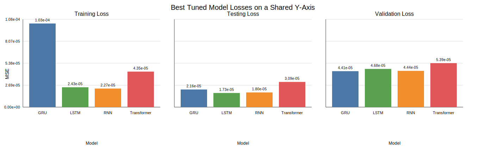

# Hyper-Parameter Impact Report

This report summarises how the tuning workflow changed model performance and compares the best tuned runs across models.

## Best tuned configuration by model

| Model | Best validation MSE | Best testing MSE | Best training MSE | MAE | DA | Hyperparameters | Run ID |
| :--- | ---: | ---: | ---: | ---: | ---: | :--- | :--- |
| GRU | 4.40569e-05 | 2.15908e-05 | 0.000102501 | 0.00318081 | 54.53% | `{"hidden": 128, "input_size": 8, "layers": 2}` | `gru_experiment-20260327T173814Z` |
| RNN | 4.44248e-05 | 1.79668e-05 | 2.27276e-05 | 0.0030937 | 55.92% | `{"hidden": 64, "input_size": 8, "layers": 2}` | `rnn_experiment-20260327T174030Z` |
| LSTM | 4.68101e-05 | 1.73179e-05 | 2.43267e-05 | 0.00312472 | 53.02% | `{"hidden": 32, "input_size": 8, "layers": 2}` | `lstm_experiment-20260327T173302Z` |
| Transformer | 5.38969e-05 | 3.08774e-05 | 4.35337e-05 | 0.00388976 | 59.57% | `{"d_model": 64, "dropout": 0.1, "input_size": 8, "nhead": 4, "num_layers": 1}` | `transformer_experiment-20260327T184712Z` |

## Stage-by-stage hyper-parameter impact

The tuning workflow was sequential, so each stage winner was selected while earlier winners stayed frozen.

### GRU

- Stage 1 (`lr`): winner 0.0001 with validation MSE 5.35509e-05; relative to the previous stage this n/a.
- Stage 2 (`hidden`): winner 128 with validation MSE 5.38729e-05; relative to the previous stage this worsened by 3.21949e-07.
- Stage 3 (`layers`): winner 2 with validation MSE 5.39895e-05; relative to the previous stage this worsened by 1.16627e-07.
- Stage 4 (`batch_size`): winner 32 with validation MSE 4.40569e-05; relative to the previous stage this improved by 9.93258e-06.

### LSTM

- Stage 1 (`lr`): winner 0.0001 with validation MSE 4.78996e-05; relative to the previous stage this n/a.
- Stage 2 (`hidden`): winner 32 with validation MSE 4.93845e-05; relative to the previous stage this worsened by 1.48484e-06.
- Stage 3 (`layers`): winner 2 with validation MSE 5.18711e-05; relative to the previous stage this worsened by 2.48665e-06.
- Stage 4 (`batch_size`): winner 128 with validation MSE 4.68101e-05; relative to the previous stage this improved by 5.06097e-06.

### RNN

- Stage 1 (`lr`): winner 0.001 with validation MSE 4.44248e-05; relative to the previous stage this n/a.
- Stage 2 (`hidden`): winner 128 with validation MSE 4.51607e-05; relative to the previous stage this worsened by 7.35932e-07.
- Stage 3 (`layers`): winner 2 with validation MSE 4.68715e-05; relative to the previous stage this worsened by 1.71082e-06.
- Stage 4 (`batch_size`): winner 128 with validation MSE 4.92007e-05; relative to the previous stage this worsened by 2.32915e-06.

### Transformer

- Stage 1 (`lr`): winner 0.001 with validation MSE 6.41828e-05; relative to the previous stage this n/a.
- Stage 2 (`d_model`): winner 64 with validation MSE 9.70754e-05; relative to the previous stage this worsened by 3.28926e-05.
- Stage 3 (`num_layers`): winner 1 with validation MSE 6.9199e-05; relative to the previous stage this improved by 2.78764e-05.
- Stage 4 (`nhead`): winner 4 with validation MSE 6.8115e-05; relative to the previous stage this improved by 1.08398e-06.
- Stage 5 (`batch_size`): winner 32 with validation MSE 5.38969e-05; relative to the previous stage this improved by 1.42181e-05.

## Interpretation

- **Validation winner:** GRU achieved the lowest validation MSE at 4.40569e-05.
- **Testing winner:** LSTM achieved the lowest testing MSE at 1.73179e-05.
- **Directional winner:** Transformer achieved the highest directional accuracy at 59.57%.
- Across the current tuning archive, recurrent models stayed tightly grouped, while the Transformer remained materially higher-loss than the recurrent models after tuning.

## Figure

The figure uses one shared y-axis across three subplots so the training, testing, and validation losses remain directly comparable.
