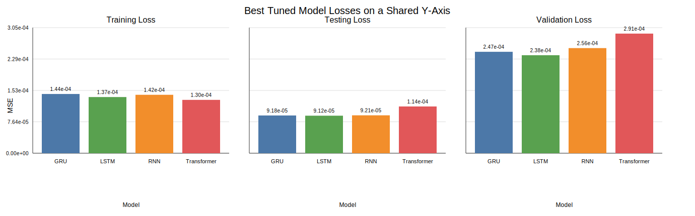

# Hyper-Parameter Impact Report

This report summarises how the tuning workflow changed model performance and compares the best tuned runs across models.

## Best tuned configuration by model

| Model | Best validation MSE | Best testing MSE | Best training MSE | MAE | DA | Hyperparameters | Run ID |
| :--- | ---: | ---: | ---: | ---: | ---: | :--- | :--- |
| LSTM | 0.000238326 | 9.12328e-05 | 0.000136578 | 0.00659305 | 54.47% | `{"hidden": 32, "input_size": 8, "layers": 2}` | `lstm_experiment-20260327T142323Z` |
| GRU | 0.000246621 | 9.17709e-05 | 0.000144026 | 0.00661732 | 53.84% | `{"hidden": 128, "input_size": 8, "layers": 2}` | `gru_experiment-20260327T142620Z` |
| RNN | 0.000255628 | 9.21392e-05 | 0.00014205 | 0.0067423 | 53.46% | `{"hidden": 64, "input_size": 8, "layers": 3}` | `rnn_experiment-20260327T143530Z` |
| Transformer | 0.000290866 | 0.000113678 | 0.000129705 | 0.00711467 | 49.56% | `{"d_model": 32, "dropout": 0.1, "input_size": 8, "nhead": 4, "num_layers": 1}` | `transformer_experiment-20260327T153725Z` |

## Stage-by-stage hyper-parameter impact

The tuning workflow was sequential, so each stage winner was selected while earlier winners stayed frozen.

### GRU

- Stage 1 (`lr`): winner 0.0001 with validation MSE 0.000257979; relative to the previous stage this n/a.
- Stage 2 (`hidden`): winner 128 with validation MSE 0.000246621; relative to the previous stage this improved by 1.13579e-05.
- Stage 3 (`layers`): winner 3 with validation MSE 0.000255134; relative to the previous stage this worsened by 8.51236e-06.
- Stage 4 (`batch_size`): winner 128 with validation MSE 0.000252707; relative to the previous stage this improved by 2.42649e-06.

### LSTM

- Stage 1 (`lr`): winner 0.0001 with validation MSE 0.000257661; relative to the previous stage this n/a.
- Stage 2 (`hidden`): winner 32 with validation MSE 0.000245888; relative to the previous stage this improved by 1.1773e-05.
- Stage 3 (`layers`): winner 2 with validation MSE 0.000240873; relative to the previous stage this improved by 5.01446e-06.
- Stage 4 (`batch_size`): winner 64 with validation MSE 0.000238326; relative to the previous stage this improved by 2.54773e-06.

### RNN

- Stage 1 (`lr`): winner 0.0001 with validation MSE 0.000255721; relative to the previous stage this n/a.
- Stage 2 (`hidden`): winner 64 with validation MSE 0.000276156; relative to the previous stage this worsened by 2.04347e-05.
- Stage 3 (`layers`): winner 3 with validation MSE 0.000278874; relative to the previous stage this worsened by 2.71878e-06.
- Stage 4 (`batch_size`): winner 128 with validation MSE 0.000255628; relative to the previous stage this improved by 2.32466e-05.

### Transformer

- Stage 1 (`lr`): winner 0.001 with validation MSE 0.000338357; relative to the previous stage this n/a.
- Stage 2 (`d_model`): winner 32 with validation MSE 0.000303832; relative to the previous stage this improved by 3.45249e-05.
- Stage 3 (`num_layers`): winner 1 with validation MSE 0.000301636; relative to the previous stage this improved by 2.19586e-06.
- Stage 4 (`nhead`): winner 4 with validation MSE 0.000299883; relative to the previous stage this improved by 1.75301e-06.
- Stage 5 (`batch_size`): winner 64 with validation MSE 0.000290866; relative to the previous stage this improved by 9.01759e-06.

## Interpretation

- **Validation winner:** LSTM achieved the lowest validation MSE at 0.000238326.
- **Testing winner:** LSTM achieved the lowest testing MSE at 9.12328e-05.
- **Directional winner:** LSTM achieved the highest directional accuracy at 54.47%.
- Across the current tuning archive, recurrent models stayed tightly grouped, while the Transformer remained materially higher-loss than the recurrent models after tuning.

## Figure

The figure uses one shared y-axis across three subplots so the training, testing, and validation losses remain directly comparable.
