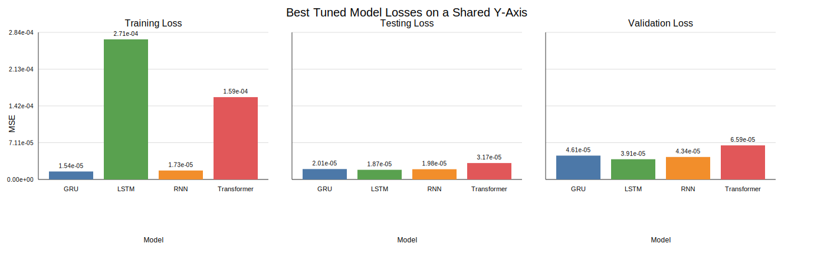

# Hyper-Parameter Impact Report

This report summarises how the tuning workflow changed model performance and compares the best tuned runs across models.

## Best tuned configuration by model

| Model | Best validation MSE | Best testing MSE | Best training MSE | MAE | DA | Hyperparameters | Run ID |
| :--- | ---: | ---: | ---: | ---: | ---: | :--- | :--- |
| LSTM | 3.90813e-05 | 1.8652e-05 | 0.000270845 | 0.00253076 | 100.00% | `{"hidden": 64, "input_size": 8, "layers": 3}` | `lstm_experiment-20260327T155300Z` |
| RNN | 4.3441e-05 | 1.97714e-05 | 1.73027e-05 | 0.00285584 | 100.00% | `{"hidden": 128, "input_size": 8, "layers": 3}` | `rnn_experiment-20260327T160424Z` |
| GRU | 4.61095e-05 | 2.01052e-05 | 1.53988e-05 | 0.00260746 | 100.00% | `{"hidden": 128, "input_size": 8, "layers": 2}` | `gru_experiment-20260327T155732Z` |
| Transformer | 6.58788e-05 | 3.17159e-05 | 0.000159158 | 0.00407302 | 98.24% | `{"d_model": 32, "dropout": 0.1, "input_size": 8, "nhead": 4, "num_layers": 1}` | `transformer_experiment-20260327T164608Z` |

## Stage-by-stage hyper-parameter impact

The tuning workflow was sequential, so each stage winner was selected while earlier winners stayed frozen.

### GRU

- Stage 1 (`lr`): winner 0.001 with validation MSE 4.68057e-05; relative to the previous stage this n/a.
- Stage 2 (`hidden`): winner 128 with validation MSE 4.61095e-05; relative to the previous stage this improved by 6.96228e-07.
- Stage 3 (`layers`): winner 2 with validation MSE 4.64221e-05; relative to the previous stage this worsened by 3.12587e-07.
- Stage 4 (`batch_size`): winner 64 with validation MSE 4.61797e-05; relative to the previous stage this improved by 2.42419e-07.

### LSTM

- Stage 1 (`lr`): winner 0.001 with validation MSE 4.23139e-05; relative to the previous stage this n/a.
- Stage 2 (`hidden`): winner 64 with validation MSE 4.12661e-05; relative to the previous stage this improved by 1.04776e-06.
- Stage 3 (`layers`): winner 3 with validation MSE 4.65947e-05; relative to the previous stage this worsened by 5.32858e-06.
- Stage 4 (`batch_size`): winner 32 with validation MSE 3.90813e-05; relative to the previous stage this improved by 7.51337e-06.

### RNN

- Stage 1 (`lr`): winner 0.001 with validation MSE 5.18832e-05; relative to the previous stage this n/a.
- Stage 2 (`hidden`): winner 128 with validation MSE 4.95985e-05; relative to the previous stage this improved by 2.28477e-06.
- Stage 3 (`layers`): winner 3 with validation MSE 4.3441e-05; relative to the previous stage this improved by 6.15745e-06.
- Stage 4 (`batch_size`): winner 32 with validation MSE 4.38212e-05; relative to the previous stage this worsened by 3.80157e-07.

### Transformer

- Stage 1 (`lr`): winner 0.0005 with validation MSE 7.80448e-05; relative to the previous stage this n/a.
- Stage 2 (`d_model`): winner 32 with validation MSE 9.69716e-05; relative to the previous stage this worsened by 1.89268e-05.
- Stage 3 (`num_layers`): winner 1 with validation MSE 6.58788e-05; relative to the previous stage this improved by 3.10928e-05.
- Stage 4 (`nhead`): winner 8 with validation MSE 6.91919e-05; relative to the previous stage this worsened by 3.31307e-06.
- Stage 5 (`batch_size`): winner 32 with validation MSE 6.65617e-05; relative to the previous stage this improved by 2.63019e-06.

## Interpretation

- **Validation winner:** LSTM achieved the lowest validation MSE at 3.90813e-05.
- **Testing winner:** LSTM achieved the lowest testing MSE at 1.8652e-05.
- **Directional winner:** LSTM achieved the highest directional accuracy at 100.00%.
- Across the current tuning archive, recurrent models stayed tightly grouped, while the Transformer remained materially higher-loss than the recurrent models after tuning.

## Figure

The figure uses one shared y-axis across three subplots so the training, testing, and validation losses remain directly comparable.
