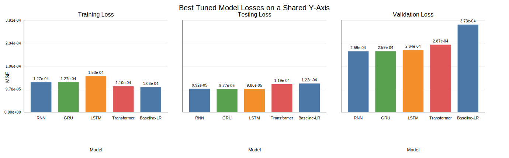

# Hyper-Parameter Impact Report

This report summarises how the tuning workflow changed model performance and compares the best tuned runs across models.

## Best tuned configuration by model

| Model | Best validation MSE | Best testing MSE | Best training MSE | MAE | DA | Hyperparameters | Run ID |
| :--- | ---: | ---: | ---: | ---: | ---: | :--- | :--- |
| GRU | 5.49423e-07 | 5.10508e-07 | 5.6723e-07 | 0.000567138 | 97.56% | `{"hidden": 64, "input_size": 8, "layers": 2}` | `gru_experiment-20260327T123855Z` |
| LSTM | 7.00707e-07 | 2.86436e-07 | 3.63846e-07 | 0.000422093 | 97.56% | `{"hidden": 64, "input_size": 8, "layers": 2}` | `lstm_experiment-20260327T123349Z` |
| RNN | 7.79164e-07 | 1.05906e-06 | 6.54422e-07 | 0.000812174 | 96.75% | `{"hidden": 64, "input_size": 8, "layers": 2}` | `rnn_experiment-20260327T124102Z` |
| Transformer | 1.11486e-05 | 1.499e-05 | 0.000132878 | 0.00300531 | 91.60% | `{"d_model": 32, "dropout": 0.1, "input_size": 8, "nhead": 2, "num_layers": 1}` | `transformer_experiment-20260327T141015Z` |

## Stage-by-stage hyper-parameter impact

The tuning workflow was sequential, so each stage winner was selected while earlier winners stayed frozen.

### GRU

- Stage 1 (`lr`): winner 0.001 with validation MSE 5.9329e-07; relative to the previous stage this n/a.
- Stage 2 (`hidden`): winner 64 with validation MSE 2.38629e-06; relative to the previous stage this worsened by 1.793e-06.
- Stage 3 (`layers`): winner 2 with validation MSE 5.49423e-07; relative to the previous stage this improved by 1.83687e-06.
- Stage 4 (`batch_size`): winner 32 with validation MSE 1.20021e-06; relative to the previous stage this worsened by 6.50782e-07.

### LSTM

- Stage 1 (`lr`): winner 0.001 with validation MSE 7.00707e-07; relative to the previous stage this n/a.
- Stage 2 (`hidden`): winner 128 with validation MSE 9.67344e-07; relative to the previous stage this worsened by 2.66637e-07.
- Stage 3 (`layers`): winner 1 with validation MSE 8.75532e-07; relative to the previous stage this improved by 9.18117e-08.
- Stage 4 (`batch_size`): winner 64 with validation MSE 6.29445e-06; relative to the previous stage this worsened by 5.41892e-06.

### RNN

- Stage 1 (`lr`): winner 0.0005 with validation MSE 1.70435e-06; relative to the previous stage this n/a.
- Stage 2 (`hidden`): winner 64 with validation MSE 9.97596e-06; relative to the previous stage this worsened by 8.27161e-06.
- Stage 3 (`layers`): winner 2 with validation MSE 1.83655e-06; relative to the previous stage this improved by 8.13941e-06.
- Stage 4 (`batch_size`): winner 32 with validation MSE 7.79164e-07; relative to the previous stage this improved by 1.05738e-06.

### Transformer

- Stage 1 (`lr`): winner 0.0005 with validation MSE 1.63056e-05; relative to the previous stage this n/a.
- Stage 2 (`d_model`): winner 32 with validation MSE 1.13145e-05; relative to the previous stage this improved by 4.99111e-06.
- Stage 3 (`num_layers`): winner 1 with validation MSE 2.05021e-05; relative to the previous stage this worsened by 9.18755e-06.
- Stage 4 (`nhead`): winner 2 with validation MSE 1.22381e-05; relative to the previous stage this improved by 8.264e-06.
- Stage 5 (`batch_size`): winner 32 with validation MSE 1.11486e-05; relative to the previous stage this improved by 1.08948e-06.

## Interpretation

- **Validation winner:** GRU achieved the lowest validation MSE at 5.49423e-07.
- **Testing winner:** LSTM achieved the lowest testing MSE at 2.86436e-07.
- **Directional winner:** GRU achieved the highest directional accuracy at 97.56%.
- Across the current tuning archive, recurrent models stayed tightly grouped, while the Transformer remained materially higher-loss than the recurrent models after tuning.

## Figure

The figure uses one shared y-axis across three subplots so the training, testing, and validation losses remain directly comparable.
